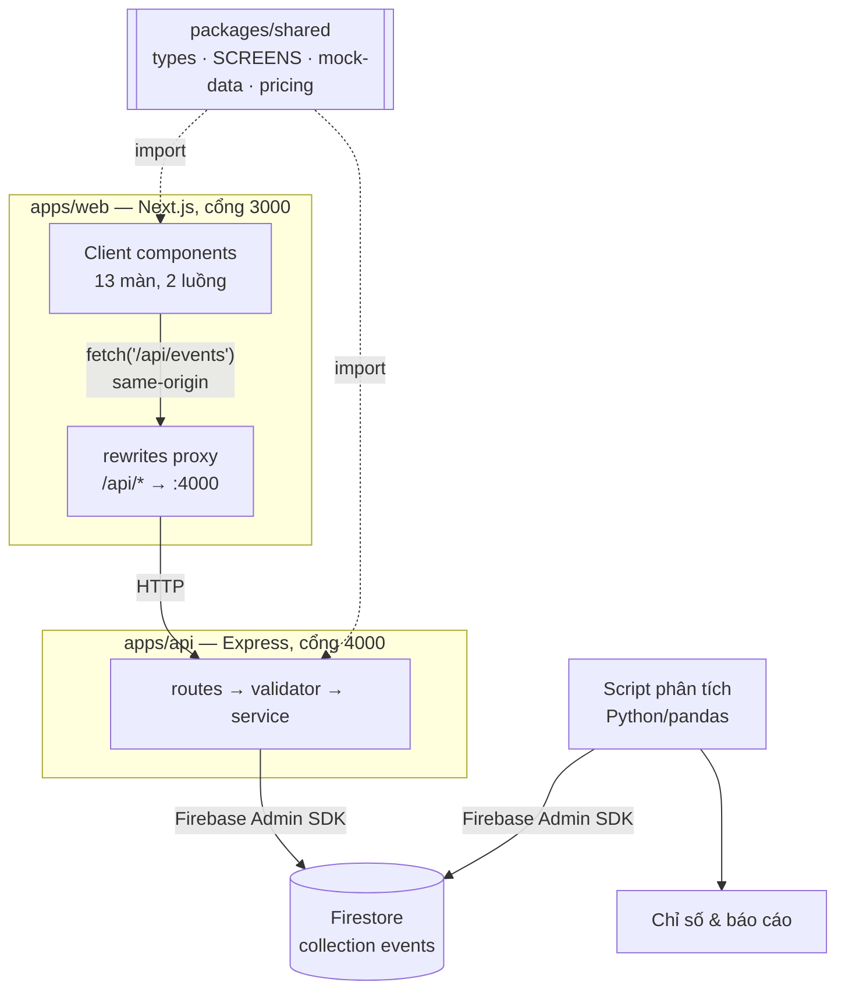

# architecture.md — GSM ride-booking simulation

## Sơ đồ tổng thể

Monorepo npm workspaces, **hai process riêng biệt**:



Mũi tên đứt nét từ `packages/shared` là điểm đáng chú ý: cả FE lẫn BE cùng import `EventName` và bảng `SCREENS` từ đó, nên danh sách hợp lệ ở hai bên **không thể lệch nhau**.

## Từng khối làm gì

### 1. `apps/web` — Next.js, chỉ frontend
- Hiển thị UI, điều hướng giữa các màn hình của 2 luồng (Đặt xe, Food — chi tiết ở `DESIGN.md`, route và state ở `screen-map.md`).
- Dữ liệu tĩnh (địa chỉ, loại xe, khuyến mãi, menu, ưu đãi) lấy từ `packages/shared` — nội dung cụ thể ở `mock-data.md`, không gọi API cho phần này.
- **Không có `firebase-admin` trong `dependencies`** — đây là hàng rào thật, không phải quy ước: FE muốn chạm Firestore cũng không import nổi. Chỉ gọi `fetch('/api/events', ...)`.
- `next.config.ts` khai báo `rewrites` proxy `/api/*` sang cổng 4000, nên phía trình duyệt mọi request là same-origin — **không có preflight OPTIONS**. Lý do đầy đủ ở `techstack.md`.

### 2. `apps/api` — Express, chỉ backend
- Process riêng (`tsx watch src/server.ts`), cổng 4000. Không biết gì về React.
- Là nơi **duy nhất** trong toàn monorepo cầm Firebase Admin SDK và credential.
- Luồng xử lý một request: `routes/` (HTTP) → `validators/` (whitelist 8 field) → `services/` (gắn `platform` + `serverTimestamp`, ghi Firestore).
- Cũng cung cấp đường đọc lại dữ liệu (theo session, theo flow...) cho phân tích/replay.

### 2b. `packages/shared` — hợp đồng dữ liệu
- `types.ts` (19 `EventName`, 13 `ScreenName`), `screens.ts` (bảng route/`step_index`/flow), `mock-data.ts`, `pricing.ts`.
- Phụ thuộc **một chiều**: `apps/*` import từ đây, không có chiều ngược lại.
- `step_index` chỉ tồn tại ở một chỗ duy nhất — bảng `SCREENS`. Gõ tay ở 13 page là nguồn sai số liệu không có triệu chứng.

### 3. Database — Firestore
- 1 collection `events`, mỗi lần click = 1 document mới (append-only, không update/xoá).
- Chi tiết cấu trúc document ở `db-design.md`; danh sách event và ý nghĩa từng field ở `event-taxonomy.md`.

### 4. Phân tích — Python/pandas
- Script riêng, chạy tách biệt, không phải 1 phần của Next.js app.
- Dùng thư viện `firebase-admin` (Python) với service account credentials riêng để đọc toàn bộ collection `events`, chuyển thành DataFrame, tính các chỉ số.
- Danh sách chỉ số cần tính ở `analysis-spec.md`.

## Quy tắc quan trọng
> **Trình duyệt (browser) không bao giờ cầm Firebase Admin credential và không bao giờ gọi Firestore trực tiếp.** Chỉ 2 nơi được phép chạm Firestore: `apps/api` (phục vụ app) và script Python (phục vụ phân tích) — cả hai đều chạy server-side/offline, không chạy trong trình duyệt người dùng.

Kiểm tra được bằng một lệnh:
```bash
grep -r "firebase-admin" apps/web/ --exclude-dir=node_modules --exclude-dir=.next   # phải rỗng
```

## Chạy thử ở máy local
- `npm run dev` ở thư mục gốc chạy song song cả 2 process (`concurrently`). Trình duyệt luôn vào `localhost:3000`.
- Kiểm tra theo thứ tự: `curl localhost:4000/api/health` (BE sống) → `curl localhost:3000/api/health` (proxy thông). Bước 2 hỏng mà bước 1 chạy nghĩa là sai `rewrites`, không phải sai Express.
- Tạo Firebase project trên console, bật Firestore, tải service account key (JSON) — 3 giá trị vào `apps/api/.env` (**không commit lên git**).
- Script Python phân tích cũng cần service account key (cùng key hoặc key riêng) để kết nối `firebase-admin` (Python).