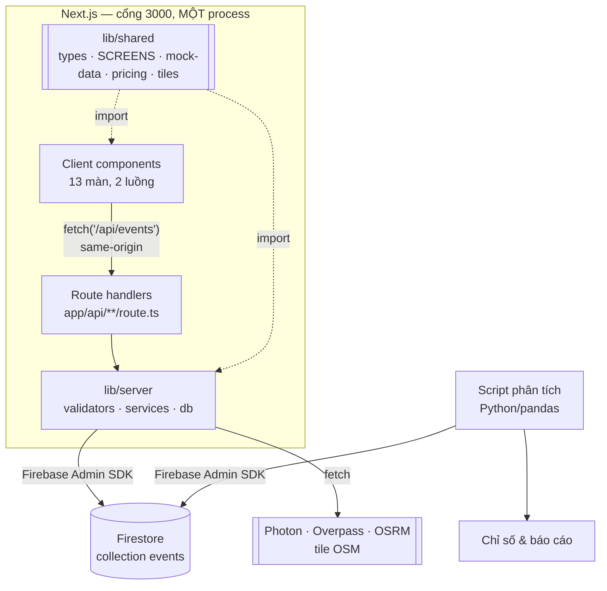

# architecture.md — GSM ride-booking simulation

## Sơ đồ tổng thể

**Một project Next.js duy nhất**, một process, một lệnh `next dev`:



Hai mũi tên đứt nét từ `lib/shared` là điểm đáng chú ý: cả giao diện lẫn route handler cùng import `EventName` và bảng `SCREENS` từ đó, nên danh sách hợp lệ ở hai phía **không thể lệch nhau**.

> **Đã từng có một bản hai process** (`apps/web` Next.js + `apps/api` Express, nối nhau bằng `rewrites` proxy). Nó bị gỡ bỏ vì deploy: `apps/api` phải được host riêng, mà quên làm việc đó thì proxy trỏ về `http://localhost:4000` và **mọi** `/api/*` chết — kể cả đường ghi event, im lặng, vì `lib/track.ts` cố tình nuốt lỗi. Xem mục "Cái giá của việc gộp" ở cuối file.

## Từng khối làm gì

> File này dừng ở **mức khối**. Xuống tới từng file, từng component, từng lớp:
> **`fe-structure.md`** (giao diện) và **`be-structure.md`** (route handler + `lib/server`).

### 1. Client — `app/`, `components/`, `lib/` (trừ `lib/server`)
- Hiển thị UI, điều hướng giữa các màn của 2 luồng (chi tiết ở `DESIGN.md`, route và state ở `screen-map.md`).
- Dữ liệu tĩnh (địa chỉ, loại xe, khuyến mãi, menu, ưu đãi) lấy từ `lib/shared` — nội dung cụ thể ở `mock-data.md`, không gọi API cho phần này.
- **Không bao giờ** import `firebase-admin` hay cầm credential Firestore — chỉ gọi `fetch('/api/events', ...)` tới route handler nội bộ của chính project.
- Mọi page đều `'use client'`.

### 2. Server — `app/api/**/route.ts` + `lib/server/`
- Nằm trong cùng project Next.js, nhưng code chạy phía server — **không bao giờ bị gửi xuống trình duyệt**.
- Là nơi **duy nhất** cầm Firebase Admin SDK và credential.
- Luồng xử lý một request: `app/api/<tên>/route.ts` (HTTP) → `lib/server/validators/` (whitelist 8 field) → `lib/server/services/` (gắn `platform` + `serverTimestamp`, ghi Firestore).
- Cũng cung cấp đường đọc lại dữ liệu (theo session, theo flow...) cho phân tích/replay, và bốn endpoint tra cứu dữ liệu thật (địa chỉ, quán ăn, tuyến đường, tile).
- `lib/server/services/upstream.ts` là hàng đợi + cache dùng chung cho mọi lời gọi ra dịch vụ ngoài — lý do tồn tại ở `api-endpoints.md` mục 3b.

### 2b. `lib/shared` — hợp đồng dữ liệu
- `types.ts` (`EventName`, `ScreenName`), `screens.ts` (bảng route/`step_index`/flow), `mock-data.ts`, `food.ts`, `pricing.ts`, `places.ts`, `route.ts`, `tiles.ts`.
- Phụ thuộc **một chiều**: client và `lib/server` import từ đây, không có chiều ngược lại. **`lib/shared` không được import gì từ `lib/server`** — nó chạy trong trình duyệt.
- `step_index` chỉ tồn tại ở một chỗ duy nhất — bảng `SCREENS`. Gõ tay ở 13 page là nguồn sai số liệu không có triệu chứng.

### 3. Database — Firestore
- 1 collection `events`, mỗi lần click = 1 document mới (append-only, không update/xoá).
- Chi tiết cấu trúc document ở `db-design.md`; danh sách event và ý nghĩa từng field ở `event-taxonomy.md`.

### 4. Phân tích — Python/pandas
- Script riêng, chạy tách biệt, không phải 1 phần của Next.js app.
- Dùng `firebase-admin` (Python) với service account credentials để đọc toàn bộ collection `events`, chuyển thành DataFrame, tính các chỉ số. **Không gọi HTTP qua app** — nó nói thẳng với Firestore.
- Danh sách chỉ số cần tính ở `analysis-spec.md`.

## Quy tắc quan trọng

> **Trình duyệt không bao giờ cầm Firebase Admin credential và không bao giờ gọi Firestore trực tiếp.** Chỉ 2 nơi được phép chạm Firestore: route handler (phục vụ app) và script Python (phục vụ phân tích) — cả hai đều chạy server-side/offline, không chạy trong trình duyệt người dùng.

Khi còn hai package, hàng rào này là **vật lý**: package giao diện không có `firebase-admin` trong `dependencies` nên không import nổi. Gộp một project thì hàng rào đó biến mất, và nó được dựng lại ở chỗ khác — gói **`server-only`**:

```bash
# Không file nào ngoài app/api/ được import lib/server/
grep -rn "lib/server" app components lib --include=*.ts --include=*.tsx \
  | grep -v "^app/api/" | grep -v "^lib/server/"     # phải rỗng
```

Hàng rào thật nằm ở build chứ không ở lệnh grep này: `lib/server/db/firebase-admin.ts` và cả năm service đều mở đầu bằng `import 'server-only'`, nên kéo chúng vào một Client Component là **build đỏ ngay**, không phải lỗi lúc chạy.

## Chạy thử ở máy local
- `npm run dev` — **một lệnh, một process**. Trình duyệt vào `localhost:3000`.
- Kiểm tra: `curl localhost:3000/api/health` → `{"status":"ok"}`. Route này cố tình **không chạm Firestore**, nên nó trả lời được cả khi chưa có credential — xác nhận app sống trước khi Firebase vào cuộc.
- Tạo Firebase project trên console, bật Firestore, tải service account key (JSON) — 3 giá trị vào **`.env.local`** ở gốc repo (**không commit lên git**).
- Script Python phân tích đọc chính `.env.local` đó, hoặc một service account key riêng.

## Cái giá của việc gộp

Gộp lấy lại được sự đơn giản, nhưng mất một thứ có thật, và nó đáng ghi ra đây để sau này không ai phải đoán:

**`lib/server/services/upstream.ts` chỉ còn hiệu lực trong phạm vi một instance.** Nó là hàng đợi nối tiếp + cache trong bộ nhớ của một tiến trình: `minGapMs` giãn các lần gọi Photon/OSRM ra ≥600ms để không bị chặn IP. Trên Vercel mỗi lambda instance có module scope riêng, nên nhiều instance chạy song song thì Photon/Overpass/OSRM nhìn thấy request dồn dập hơn dự tính, và tỉ lệ trúng cache giảm.

Với một app demo tự click sinh dữ liệu thì rủi ro thấp. Nhưng **nếu bị OSM chặn IP giữa buổi demo thì đây là chỗ đầu tiên nhìn vào**, không phải lỗi mạng.

**`POST /api/events` là endpoint mở khi deploy công khai.** Trình duyệt gọi thẳng vào nó, nên không còn chặng server→server nào để giấu một khoá chia sẻ: bất cứ thứ gì `lib/track.ts` gửi được thì người dùng cũng đọc được trong bundle. Nguyên tắc vì vậy giữ nguyên như `api-endpoints.md` đã chốt từ đầu — **sinh xong dữ liệu phân tích rồi hãy deploy công khai**.
