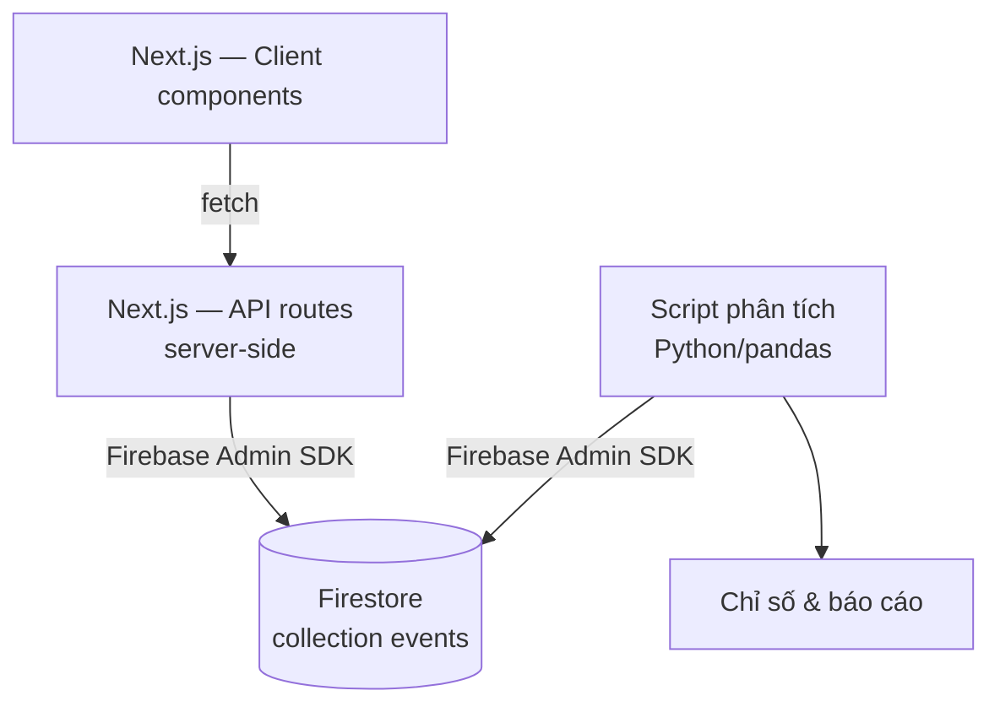

# architecture.md — GSM ride-booking simulation

## Sơ đồ tổng thể

## Từng khối làm gì

### 1. Client — Next.js (React components)
- Hiển thị UI, điều hướng giữa các màn hình của 2 luồng (Đặt xe, Food — chi tiết ở `DESIGN.md`, route và state ở `screen-map.md`).
- Dữ liệu tĩnh (địa chỉ, loại xe, khuyến mãi, menu, ưu đãi) hardcode ngay trong client — nội dung cụ thể ở `mock-data.md`, không cần gọi API cho phần này.
- **Không bao giờ** import Firebase Admin SDK hay cầm credential Firestore — chỉ gọi `fetch('/api/events', ...)` tới API route nội bộ của chính project.

### 2. Server — Next.js API routes
- Nằm trong cùng project Next.js (`app/api/.../route.ts`), nhưng code chạy phía server — không bao giờ bị gửi xuống trình duyệt.
- Là nơi duy nhất trong app cầm Firebase Admin SDK và credential để đọc/ghi Firestore.
- Nhận request từ client, validate dữ liệu, ghi document mới vào collection `events`; cũng cung cấp đường đọc lại dữ liệu (theo session, theo flow...) cho phân tích/replay.

### 3. Database — Firestore
- 1 collection `events`, mỗi lần click = 1 document mới (append-only, không update/xoá).
- Chi tiết cấu trúc document ở `db-design.md`; danh sách event và ý nghĩa từng field ở `event-taxonomy.md`.

### 4. Phân tích — Python/pandas
- Script riêng, chạy tách biệt, không phải 1 phần của Next.js app.
- Dùng thư viện `firebase-admin` (Python) với service account credentials riêng để đọc toàn bộ collection `events`, chuyển thành DataFrame, tính các chỉ số.
- Danh sách chỉ số cần tính ở `analysis-spec.md`.

## Quy tắc quan trọng
> **Trình duyệt (browser) không bao giờ cầm Firebase Admin credential và không bao giờ gọi Firestore trực tiếp.** Chỉ 2 nơi được phép chạm Firestore: Next.js API routes (phục vụ app) và script Python (phục vụ phân tích) — cả hai đều chạy server-side/offline, không chạy trong trình duyệt người dùng.

## Chạy thử ở máy local (gợi ý)
- 1 lệnh `next dev` chạy cả client lẫn API routes cùng lúc — không cần chạy 2 server riêng như bản Node/Express trước.
- Tạo Firebase project trên console, bật Firestore, tải service account key (JSON) — lưu vào biến môi trường (`.env.local`, **không commit lên git**), dùng để khởi tạo Firebase Admin SDK trong API routes.
- Script Python phân tích cũng cần service account key (cùng key hoặc key riêng) để kết nối `firebase-admin` (Python).