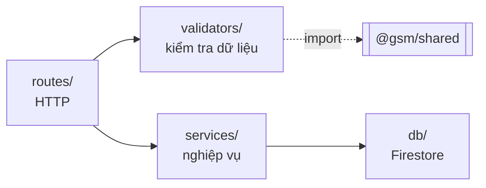

# be-structure.md — cấu trúc backend (`apps/api`)

Mô tả **code hiện có** trong `apps/api`: bốn lớp, mỗi lớp làm gì và không được làm gì, một request đi qua chúng ra sao.

Đây không phải hợp đồng API. Muốn biết endpoint nào nhận field gì, trả mã lỗi nào → `api-endpoints.md`. Muốn biết document Firestore hình dạng ra sao → `db-design.md`. File này trả lời câu khác: **code hiện thực những thứ đó ra sao**.

---

## 1. Vai trò

Express + TypeScript chạy qua `tsx`, cổng **4000**, process hoàn toàn riêng với `apps/web`.

Ba điều quyết định hình dạng thư mục này:

- **Nơi duy nhất trong monorepo cầm credential Firestore.** `apps/web` không có `firebase-admin` trong `dependencies` nên không import nổi.
- **Không biết gì về React.** Không JSX, không component, không render.
- **Không có bước build.** `tsx` chạy thẳng `.ts`; script `dev` là `tsx watch --env-file-if-exists=.env src/server.ts`.

Trình duyệt **không gọi thẳng** vào đây — `apps/web` proxy `/api/*` sang cổng này. `cors()` bật cho `WEB_ORIGIN` chỉ phục vụ gọi thẳng bằng curl/Postman khi debug.

---

## 2. Cây thư mục

```
apps/api/
├─ package.json          dev: tsx watch --env-file-if-exists=.env src/server.ts
├─ tsconfig.json
├─ .env.example          FIREBASE_* · PORT · WEB_ORIGIN   (bản thật .env đã gitignore)
└─ src/
   ├─ server.ts                     47 dòng  express + cors + json + listen + xử lý EADDRINUSE
   ├─ routes/
   │  ├─ events.routes.ts           50 dòng  POST và GET /api/events
   │  └─ health.routes.ts           14 dòng  GET /api/health — không chạm Firestore
   ├─ validators/
   │  └─ event.validator.ts        162 dòng  whitelist 8 field + validate query
   ├─ services/
   │  └─ event.service.ts           53 dòng  createEvent · listEvents
   └─ db/
      └─ firebase-admin.ts          56 dòng  getDb() — khởi tạo trễ
```

Sáu file, 382 dòng. `event.validator.ts` chiếm 42% — xem mục 4 để biết vì sao.

---

## 3. Kiến trúc bốn lớp



Ranh giới trách nhiệm — **mỗi lớp không được làm gì** cũng quan trọng như nó làm gì:

| Lớp | Làm | **Không** làm |
|---|---|---|
| `server.ts` | Dựng app, middleware, mở cổng | Không chứa logic nghiệp vụ nào |
| `routes/` | Đọc request, gọi validator, gọi service, chọn mã HTTP | Không tự validate, không tự gọi Firestore |
| `validators/` | Kiểm tra kiểu và giá trị, whitelist field | Không chạm Firestore, không biết Express |
| `services/` | Gắn field server, ghi/đọc Firestore, chuẩn hoá kết quả | Không biết `req`/`res`, không trả mã HTTP |
| `db/` | Khởi tạo Admin SDK, trả `Firestore` | Không biết collection nào đang được truy vấn |

Lợi ích cụ thể: `validators/` không phụ thuộc Express nên test được bằng cách gọi hàm thẳng, và `services/` không phụ thuộc HTTP nên script Python hay job nền sau này dùng lại được.

---

## 4. Từng lớp

### `server.ts` (47 dòng)

```ts
app.use(cors({ origin: WEB_ORIGIN }));
app.use(express.json({ limit: '64kb' }));
app.use('/api', healthRouter);
app.use('/api', eventsRouter);
app.use(/* 404 fallback */);
```

`PORT` và `WEB_ORIGIN` đọc từ env, có giá trị mặc định (`4000`, `http://localhost:3000`) nên chạy được ngay khi chưa có `.env`.

Có `server.on('error')` bắt `EADDRINUSE` và thoát với thông báo rõ. Thiếu handler này thì lỗi mở cổng bị nuốt và **tiến trình treo im lặng, không in gì ra cả stdout lẫn stderr** — người dùng tưởng BE vẫn sống và đi tìm nhầm chỗ.

### `routes/health.routes.ts` (14 dòng)
```
GET /api/health → { "status": "ok" }
```
**Không chạm Firestore.** Nhờ vậy nó trả lời được ngay cả khi chưa có credential — đúng mục đích: xác nhận Express chạy đúng *trước khi* Firebase vào cuộc, để hai loại lỗi không trộn vào nhau.

### `routes/events.routes.ts` (50 dòng)
```ts
export const eventsRouter: Router
```
Hai handler, mỗi handler cùng một khuôn: validate → sai thì 400 → đúng thì gọi service trong `try/catch` → lỗi thì log đầy đủ phía server và trả JSON gọn cho client.

### `validators/event.validator.ts` (162 dòng) — file lớn nhất BE
```ts
validateEventPayload(body: unknown): ValidationResult
validateEventQuery(params: URLSearchParams): QueryValidationResult
```

Dài vì kiểm **từng field một** và trả đúng câu lỗi mà `api-endpoints.md` quy định, phân biệt "thiếu field" với "sai kiểu":

```
{ "error": "Missing required field: flow" }
{ "error": "Invalid value for flow: expected \"ride\" | \"food\" | \"none\"" }
```

Hai điểm thiết kế:

- **Whitelist, không blacklist.** Chỉ đúng 8 field được lấy ra từ body; mọi field lạ bị bỏ **im lặng** (không trả lỗi). Nhờ vậy client gửi kèm `platform` hay `created_at` cũng không ghi đè được giá trị server tự gắn.
- **Danh sách hợp lệ nhập từ `@gsm/shared`**, không gõ lại: `isEventName`, `isFlowValue`, `isScreenName`. Đây là lý do danh sách `event_name`/`screen_name` ở FE và BE **không thể lệch nhau** — thêm một event chỉ phải sửa một chỗ.

Trả về kiểu union `{ ok: true, value } | { ok: false, error }` nên TypeScript ép route phải xử lý nhánh lỗi trước khi chạm `value`.

### `services/event.service.ts` (53 dòng)
```ts
createEvent(payload): Promise<CreateEventResponse>
listEvents(query): Promise<Record<string, unknown>[]>
```

`createEvent` gắn hai field **server-side**, không bao giờ tin client:
```ts
platform: 'web',
created_at: FieldValue.serverTimestamp(),
```

Response trả `created_at: new Date().toISOString()` — **giá trị xấp xỉ**, lệch vài mili-giây, vì `serverTimestamp()` chưa có giá trị thật lúc `.add()` trả về. Giá trị chuẩn dùng cho phân tích là field trong Firestore. Không đọc lại document sau khi ghi: tốn thêm một read mà client cũng bỏ qua response.

`listEvents` đổi `Timestamp` sang **chuỗi ISO** trước khi trả. Timestamp của Firestore serialize ra JSON thành `{_seconds, _nanoseconds}` mà cả `jq` lẫn pandas đều không đọc được.

### `db/firebase-admin.ts` (56 dòng)
```ts
export const EVENTS_COLLECTION = 'events';
export function getDb(): Firestore
```

Ba chi tiết bắt buộc, đừng lược bỏ:

- **`getApps()[0] ?? initializeApp(...)`** — `tsx watch` chạy lại module nhiều lần trong cùng tiến trình; gọi `initializeApp()` thẳng sẽ ném `The default Firebase app already exists` ngay lần sửa file thứ hai.
- **`.replace(/\\n/g, '\n')`** cho private key — trong `.env` ký tự xuống dòng ở dạng literal `\n`; thiếu bước này sẽ lỗi `error:1E08010C:DECODER routines::unsupported`.
- **Khởi tạo trễ** — xem mục 8.

Thiếu biến môi trường thì ném lỗi **chỉ rõ thiếu biến nào** và phải làm gì, chứ không để Firebase ném lỗi khó hiểu:
```
Thieu bien moi truong Firebase: FIREBASE_PROJECT_ID, FIREBASE_CLIENT_EMAIL, FIREBASE_PRIVATE_KEY.
Copy apps/api/.env.example thanh apps/api/.env roi dien gia tri (xem setup.md Phase 1).
```

---

## 5. Luồng `POST /api/events`

Tiếp nối mục 7 của `fe-structure.md` — request đã rời trình duyệt và qua proxy:

```
1. :3000/api/events          Next.js rewrites → :4000/api/events
2. cors() + express.json()   parse body, giới hạn 64kb
3. eventsRouter POST         nhận req.body (kiểu unknown)
4. validateEventPayload      8 field, whitelist; sai → 400, dừng tại đây
5. createEvent(value)        gắn platform: 'web' + FieldValue.serverTimestamp()
6. getDb().collection('events').add(...)   ← lần đầu mới chạy initializeApp
7. 201 { event_id, created_at }            ← created_at xấp xỉ, xem mục 4
```

Bước 4 là hàng rào: không gì chạm tới Firestore trước khi qua được nó. Bước 5–6 là nơi duy nhất `platform` và `created_at` được sinh ra — client gửi lên cũng đã bị bước 4 loại.

FE **không đọc response** này (`trackEvent` là `fetch(...).catch(() => {})`). Mã 201 và `event_id` chỉ hữu ích khi debug bằng curl.

## 6. Luồng `GET /api/events`

Bốn param đều optional và ghép được với nhau:

```ts
if (query.sessionId) ref = ref.where('session_id', '==', ...)
if (query.flow)      ref = ref.where('flow', '==', ...)
if (query.from)      ref = ref.where('created_at', '>=', Timestamp.fromDate(...))
if (query.to)        ref = ref.where('created_at', '<=', Timestamp.fromDate(...))

ref = query.sessionId ? ref.orderBy('step_index') : ref.orderBy('created_at');
```

Cách sắp xếp đổi theo mục đích truy vấn:
- **Có `session_id`** → `orderBy('step_index')`. Đang xem lại một phiên, muốn thấy đúng thứ tự bước để replay và kiểm chứng tracking.
- **Không có** → `orderBy('created_at')`. Đang kéo dữ liệu nhiều phiên, thứ tự thời gian mới có nghĩa.

---

## 7. Xử lý lỗi — ba loại, ba cách

| Loại | Mã | Nguồn | Cách xử lý |
|---|:--:|---|---|
| Dữ liệu sai | **400** | `validators/` | Trả đúng câu lỗi trong `api-endpoints.md`. Không log — lỗi của client |
| Ghi Firestore hỏng | **500** | `createEvent` | Log đầy đủ phía server, trả `{ error: "Could not write event" }` gọn |
| Đọc Firestore hỏng | **500** | `listEvents` | Log **và** trả nguyên văn message của Firestore |
| Cổng bị chiếm | — | `server.on('error')` | In thông báo rõ rồi `process.exit(1)` |

**Vì sao `listEvents` trả nguyên văn message còn `createEvent` thì không:** query kết hợp `where` + `orderBy` trên hai field khác nhau sẽ bị Firestore từ chối **kèm một link tạo index sẵn trong thông báo lỗi**. Nuốt message đi là vứt mất đường dẫn cần đi. Bấm link, đợi index build ~1 phút, chạy lại.

---

## 8. Vì sao khởi tạo trễ

`getDb()` chỉ chạy `initializeApp` ở request đầu tiên thực sự cần Firestore, thay vì lúc module load:

```ts
let firestore: Firestore | null = null;
export function getDb(): Firestore {
  if (!firestore) firestore = getFirestore(getApp());
  return firestore;
}
```

Nếu khởi tạo ngay lúc load, **server sẽ không lên được** khi chưa có `.env` — và `GET /api/health` mất hết ý nghĩa, vì nó sinh ra chính để xác nhận Express sống *trước khi* credential vào cuộc.

Nhờ khởi tạo trễ, trạng thái "chưa có Firebase" vẫn dùng được: app chạy, click hết cả hai luồng được, chỉ `POST /api/events` trả 500. Đó là trạng thái mặc định sau khi clone — xem `setup.md` mục Chạy nhanh.

---

## 9. Thêm một endpoint mới

1. **`api-endpoints.md` trước** — chốt path, method, request/response, mã lỗi. Tài liệu là hợp đồng; code đi sau.
2. **`validators/`** — thêm hàm validate, trả kiểu union `{ ok, ... }`. Danh sách giá trị hợp lệ nhập từ `@gsm/shared`, đừng gõ lại.
3. **`services/`** — thêm hàm nghiệp vụ. Không nhận `req`/`res`, chỉ nhận dữ liệu đã sạch.
4. **`routes/`** — nối hai thứ trên, chọn mã HTTP, bọc `try/catch`.
5. **Đăng ký** trong `server.ts` nếu là router mới.

Thêm field vào event thì sửa `EventPayload` trong `packages/shared/src/types.ts` **và** whitelist trong `event.validator.ts` — whitelist hiện chỉ lấy đúng 8 field, field mới không thêm vào đó sẽ bị loại im lặng.

---

## 10. Nhập gì từ `@gsm/shared`

BE dùng shared rất ít, đúng một mục đích: **hợp đồng dữ liệu**.

| Nhập | Dùng ở | Để làm gì |
|---|---|---|
| `isEventName`, `isFlowValue` | `event.validator.ts` | Kiểm tra `event_name`, `flow` |
| `isScreenName` (từ `screens.ts`) | `event.validator.ts` | Kiểm tra `screen_name`, `previous_screen` |
| `EventPayload` | validator, service | Kiểu của 8 field sau khi validate |
| `CreateEventResponse` | `event.service.ts` | Kiểu response 201 |

BE **không** dùng `mock-data.ts` hay `pricing.ts` — dữ liệu tĩnh và tính tiền là việc của FE. Server chỉ nhận con số FE đã tính và ghi xuống, không tính lại.

> Đây là điểm cần biết khi đọc dữ liệu phân tích: `final_price` trong event là giá trị FE tính rồi gửi lên, server không kiểm chứng. Trong phạm vi mô phỏng (không có tiền thật, không có người dùng đối nghịch) đây là đánh đổi có chủ ý. Cả hai phía dùng chung `calcRideTotals` / `calcFoodTotals` nên con số vẫn nhất quán với những gì hiển thị trên màn hình.

---

## 11. Trạng thái: BE đã xong tới đâu

**Không còn `TODO` nào trong `apps/api`.** Toàn repo chỉ còn **2** `TODO`, cả hai ở `analysis/metrics.py` (Tuần 5).

**BE đã chạy thật với Firestore** — không còn gì để implement.

| Endpoint | Code | Đã kiểm chứng tới đâu |
|---|:--:|---|
| `GET /api/health` | xong | ✅ Cả gọi thẳng `:4000` lẫn qua proxy `:3000` |
| `POST /api/events` — validate | xong | ✅ 6 ca lỗi, đúng từng câu chữ trong `api-endpoints.md` |
| `POST /api/events` — ghi Firestore | xong | ✅ 201 + `event_id` thật; `platform` và `created_at` do server gắn |
| `GET /api/events?session_id=` | xong | ✅ Sắp theo `step_index`, `created_at` trả về dạng ISO |
| `GET /api/events?from=` / `?to=` | xong | ✅ Chạy được, **không cần** composite index (chỉ một field) |
| `GET /api/events?flow=` | xong | ⏳ Cần composite index `flow` + `created_at` — đang chờ build |
| 404 cho route lạ | xong | ✅ `{"error":"Not found"}` |

### Composite index — hai cái, tạo bằng link trong thông báo lỗi

| Truy vấn | Index cần | Trạng thái |
|---|---|:--:|
| `?session_id=` | `session_id` + `step_index` | ✅ đã build |
| `?flow=` và `?flow=&from=&to=` | `flow` + `created_at` | ⏳ đang chờ |

Không cần đoán trước index nào: Firestore từ chối kèm **link tạo sẵn** ngay trong `error.message`, và `events.routes.ts` trả nguyên văn message đó chính vì lý do này.

### Đã kiểm chứng xuyên suốt FE → BE → Firestore

Đi trọn một lượt luồng ride trên trình duyệt cho kết quả đúng như `event-taxonomy.md`:

```
so screen_view : 7            (home + 6 màn ride — KHÔNG bị Strict Mode nhân đôi)
step di qua    : 0 → 1 → 2 → 3 → 4 → 5 → 6
previous_screen: null → null → home → home → address_selection → ...
confirm_ride   : 145000 − 29000 = 116000  ✅ khớp công thức
```

> **Một lỗi chỉ lộ ra khi click thật.** Bộ test bằng `curl` không bắt được, vì nó tự điền `previous_screen` trong payload còn app thật để `track.ts` suy ra. Dữ liệu thật cho thấy mọi event *hành động* mang `previous_screen` bằng chính màn nó đứng — trái với `event-taxonomy.md` §1. Nguyên nhân: `previousScreen` bị gán bằng màn hiện tại ngay sau khi `screen_view` bắn. Đã sửa bằng cách tách `previousScreen` / `currentScreen` và cập nhật trước khi bắn.
>
> Bài học cho các bước kiểm chứng sau: **`curl` chứng minh BE đúng, không chứng minh tracking đúng.** Hai việc khác nhau.

---

## 12. Bộ lệnh test từng endpoint

Chạy theo thứ tự này: phần không cần Firebase trước, phần cần Firebase sau. Nhờ **khởi tạo trễ** (mục 8), nửa đầu chạy được ngay sau khi clone.

Windows PowerShell dùng `curl.exe` thay cho `curl` — xem `setup.md` mục "Lệnh tương đương trên Windows".

### Nhóm A — không cần Firebase

Toàn bộ nhóm này **đã chạy thật**, output dưới đây là kết quả thật chứ không phải ví dụ minh hoạ.

```bash
curl localhost:4000/api/health
# {"status":"ok"}
```

Sáu ca validate, mỗi ca nhắm một nhánh khác nhau trong `event.validator.ts`:

```bash
post() { curl -s -w " <- HTTP %{http_code}\n" -X POST localhost:4000/api/events \
           -H 'Content-Type: application/json' -d "$1"; }

# 1. Thiếu field bắt buộc
post '{"session_id":"s1","user_id":"u1","event_name":"screen_view","screen_name":"home","step_index":0}'
# {"error":"Missing required field: flow"} <- HTTP 400

# 2. flow không thuộc union
post '{"session_id":"s1","user_id":"u1","flow":"xe","event_name":"screen_view","screen_name":"home","step_index":0}'
# {"error":"Invalid value for flow: expected \"ride\" | \"food\" | \"none\""} <- HTTP 400

# 3. event_name gõ nhầm — ca này chứng minh giá trị của @gsm/shared
post '{"session_id":"s1","user_id":"u1","flow":"ride","event_name":"select_vehicel","screen_name":"home","step_index":0}'
# {"error":"Invalid value for event_name: unknown event \"select_vehicel\""} <- HTTP 400

# 4. screen_name không có trong SCREENS
post '{"session_id":"s1","user_id":"u1","flow":"ride","event_name":"screen_view","screen_name":"checkout","step_index":0}'
# {"error":"Invalid value for screen_name: unknown screen \"checkout\""} <- HTTP 400

# 5. step_index âm
post '{"session_id":"s1","user_id":"u1","flow":"ride","event_name":"screen_view","screen_name":"home","step_index":-1}'
# {"error":"Invalid value for step_index: expected an integer >= 0"} <- HTTP 400

# 6. session_id rỗng (chỉ toàn khoảng trắng)
post '{"session_id":"  ","user_id":"u1","flow":"ride","event_name":"screen_view","screen_name":"home","step_index":0}'
# {"error":"Invalid value for session_id: expected a non-empty string"} <- HTTP 400
```

Ca số 3 đáng chú ý: `select_vehicel` thiếu một chữ cái so với `select_vehicle`. Không có `EVENT_NAMES` nhập từ `@gsm/shared`, lỗi gõ kiểu này sẽ **lọt xuống Firestore** và chỉ lộ ra ở Tuần 5 khi pandas đếm ra một event name lạ.

Body hợp lệ khi **chưa có** `.env`:

```bash
post '{"session_id":"s1","user_id":"u1","flow":"none","event_name":"screen_view","screen_name":"home","step_index":0}'
# {"error":"Could not write event"} <- HTTP 500
```

500 ở đây là **đúng như mong đợi**, không phải lỗi cần sửa. Log phía server chỉ rõ nguyên nhân:

```
[api] [POST /api/events] ghi Firestore that bai: Error: Thieu bien moi truong Firebase:
FIREBASE_PROJECT_ID, FIREBASE_CLIENT_EMAIL, FIREBASE_PRIVATE_KEY.
Copy apps/api/.env.example thanh apps/api/.env roi dien gia tri (xem setup.md Phase 1).
```

### Nhóm B — cần Firebase (sau `setup.md` Phase 1)

**Chưa chạy được ở thời điểm viết tài liệu này** — output dưới đây là hình dạng mong đợi theo `api-endpoints.md`, không phải kết quả đã bắt.

```bash
# Ghi một event thật
post '{"session_id":"s1","user_id":"u1","flow":"ride","event_name":"select_vehicle","screen_name":"vehicle_selection","step_index":3,"properties":{"vehicle_id":"veh-bike","vehicle_type":"bike","base_price":25000}}'
# → 201 {"event_id":"<firestore-doc-id>","created_at":"2026-09-16T..."}

# Đọc lại một phiên — sắp theo step_index
curl "localhost:4000/api/events?session_id=s1"

# Lọc theo luồng và khoảng thời gian — sắp theo created_at
curl "localhost:4000/api/events?flow=ride&from=2026-09-01&to=2026-09-30"
```

Kiểm tra query sai định dạng (không cần Firestore, validator chặn trước):

```bash
curl "localhost:4000/api/events?flow=xe"        # → 400 expected "ride" | "food"
curl "localhost:4000/api/events?from=hom-qua"   # → 400 expected an ISO date
curl localhost:4000/api/khong-co-route          # → 404 {"error":"Not found"}
```

> **Tổ hợp `flow` + `from`/`to` sẽ lỗi ở lần chạy đầu.** Firestore từ chối query kết hợp `where` trên hai field khác nhau khi chưa có composite index — nhưng kèm sẵn link tạo index trong thông báo lỗi. Bấm link, đợi ~1 phút, chạy lại. Đây là lý do `listEvents` trả nguyên văn message lỗi (mục 7).

### Kiểm tra xuyên suốt cả hai app

Lệnh quan trọng nhất sau mỗi thay đổi liên quan tới tracking — đi hết một luồng bằng tay rồi:

```bash
curl "localhost:3000/api/events?session_id=<id>" | jq '.[] | {event_name, screen_name, step_index}'
```

Hai điều kiện phải đúng **cùng lúc**:
- Số `screen_view` **đúng bằng** số màn đã đi qua. Gấp đôi nghĩa là `useRef` chưa chặn được React Strict Mode (lỗi phía FE, xem `fe-structure.md`).
- `step_index` khớp bảng ở `event-taxonomy.md` mục 2. Sai ở đây nghĩa là sai bảng `SCREENS`, không phải sai một page lẻ.

---

## 13. Sửa BE mà không làm hỏng dữ liệu

Ba thứ dưới đây là **hợp đồng dữ liệu**, không phải chi tiết implement. Đụng vào mà không cập nhật `event-taxonomy.md` trước sẽ làm dữ liệu cũ và mới không ghép được — và lỗi kiểu này không có triệu chứng cho tới lúc phân tích.

| Không được tự đổi | Ở đâu | Vì sao |
|---|---|---|
| Whitelist 8 field | `event.validator.ts` | Thêm field vào `EventPayload` mà quên whitelist → field bị loại **im lặng**, không báo lỗi gì |
| `platform` và `created_at` gắn phía server | `event.service.ts` | Tin giờ máy client thì mọi phân tích theo thời gian sai. Document cũ đã dùng giờ server |
| Danh sách hợp lệ nhập từ `@gsm/shared` | `event.validator.ts` | Gõ lại danh sách ở BE = hai nguồn sự thật, FE và BE sẽ lệch nhau lúc nào không hay |

### Thêm một field vào event — phải sửa hai chỗ

Đây là cái bẫy dễ mắc nhất khi sửa BE:

1. `packages/shared/src/types.ts` — thêm vào `EventPayload`.
2. `apps/api/src/validators/event.validator.ts` — thêm vào **cả** phần kiểm tra **lẫn** object `value` trả về.

Thiếu bước 2 thì hậu quả **khác nhau tuỳ field bắt buộc hay optional** — đã kiểm chứng bằng cách thêm thử field rồi chạy `tsc`:

| Kiểu field | `npm run typecheck` | Hậu quả |
|---|---|---|
| `device_type: string` (bắt buộc) | ❌ Báo lỗi ngay | `error TS2741: Property 'device_type' is missing ... but required in type 'EventPayload'`, chỉ thẳng dòng trong validator |
| `device_type?: string` (optional) | ✅ **Sạch** | Field **không bao giờ tới Firestore**. Request vẫn trả 201. Không một thông báo nào |

Nói cách khác: TypeScript che lưng cho bạn ở field bắt buộc, nhưng **không** ở field optional. Mà field mới thêm vào một schema đang chạy thường được khai optional để không phá dữ liệu cũ — tức là đúng trường hợp nguy hiểm nhất lại là trường hợp không có ai cảnh báo.

Cách phát hiện: sau khi thêm field optional, ghi một event thật rồi mở document trong Firebase console xem field có mặt không. **Đừng tin mã 201, và đừng tin `tsc` sạch.**

### Thêm một event name mới

Sửa `packages/shared/src/types.ts`: **cả** union `EventName` **lẫn** mảng `EVENT_NAMES`. Có type assertion `MissingEventNames` bắt lỗi nếu quên mảng — build sẽ đỏ. Nhưng phải cập nhật `event-taxonomy.md` trước cả hai (`CLAUDE.md` quy tắc 6).

### Đổi mã HTTP hay câu lỗi

`api-endpoints.md` quy định chính xác từng câu lỗi. Đổi câu lỗi trong code mà không sửa tài liệu là làm tài liệu thành sai — và tài liệu API sai thì tệ hơn không có.
