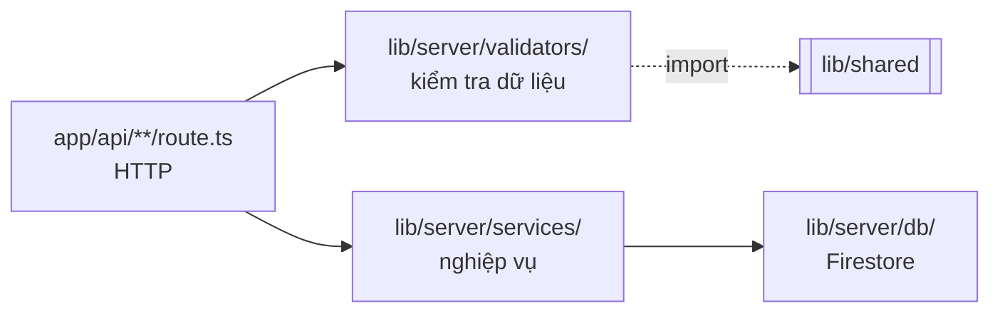

# be-structure.md — cấu trúc phía server (`app/api/` + `lib/server/`)

Mô tả **code hiện có** ở phía server: route handler, validator, service, db — mỗi lớp làm gì và không được làm gì, một request đi qua chúng ra sao.

Đây không phải hợp đồng API. Muốn biết endpoint nào nhận field gì, trả mã lỗi nào → `api-endpoints.md`. Muốn biết document Firestore hình dạng ra sao → `db-design.md`. File này trả lời câu khác: **code hiện thực những thứ đó ra sao**.

---

## 1. Vai trò

Route handler của App Router, chạy trong **cùng process** với giao diện (`next dev`, cổng 3000). Không có server thứ hai, không có cổng 4000.

> **Trước đây đây là một app Express riêng (`apps/api`, cổng 4000)**, nối với giao diện bằng `rewrites` proxy. Nó bị gỡ vì deploy: quên host nó thì proxy trỏ về `localhost:4000` và **mọi** `/api/*` chết im lặng. Lịch sử đầy đủ ở `ARCHITECTURE.md`. Điều đáng nói cho người đọc code: **validator và service không đổi một dòng nào khi chuyển** — chúng vốn không import gì từ Express. Chỉ tầng HTTP được viết lại.

Ba điều quyết định hình dạng thư mục này:

- **Nơi duy nhất cầm credential Firestore.** Không file nào ngoài `app/api/**` được import từ `lib/server/`, và hàng rào là gói `server-only`: kéo một service vào Client Component là **build đỏ ngay** (CLAUDE.md quy tắc 1).
- **Không biết gì về React.** Không JSX, không component, không render — kể cả khi giờ nó nằm chung project.
- **Mọi route đều `runtime = 'nodejs'`.** `firebase-admin` và `AbortSignal.timeout` không chạy được trên Edge runtime. Kèm `dynamic = 'force-dynamic'`: không route nào ở đây được cache tĩnh.

---

## 2. Cây thư mục

```
app/api/                            ← tầng HTTP. Tên THƯ MỤC là URL.
├─ health/route.ts                  GET  /api/health — không chạm Firestore
├─ events/route.ts                  POST + GET /api/events
├─ places/route.ts                  GET  /api/places
├─ reverse/route.ts                 GET  /api/reverse
├─ restaurants/route.ts             GET  /api/restaurants — maxDuration = 30
├─ route/route.ts                   GET  /api/route
└─ tiles/route.ts                   GET  /api/tiles — referer lấy từ chính request

lib/server/                         ← không phụ thuộc HTTP. Mọi file `import 'server-only'`.
├─ validators/
│  ├─ event.validator.ts            whitelist 8 field + validate query
│  ├─ place.validator.ts            q (2–120 ký tự) + limit (1–8)
│  └─ route.validator.ts            from/to dạng "lat,lon"
├─ services/
│  ├─ event.service.ts              createEvent · listEvents
│  ├─ photon.service.ts             Photon: tìm địa chỉ + reverse geocode
│  ├─ overpass.service.ts           Overpass: quán ăn thật theo bán kính
│  ├─ route.service.ts              OSRM: gọi + chuẩn hoá geometry sang [lat,lon]
│  ├─ tiles.service.ts              dò tile biển sâu để phát hiện watermark API key
│  └─ upstream.ts                   hàng đợi + cache, DÙNG CHUNG cho các cái trên
└─ db/
   └─ firebase-admin.ts             getDb() — khởi tạo trễ

.env.local                          FIREBASE_* · NOMINATIM_CONTACT (gitignored)
                                    Mẫu ở .env.example
```

`event.validator.ts` là file lớn nhất — xem mục 4 để biết vì sao.

> **`app/api/route/route.ts` không phải lỗi gõ.** Tên thư mục là đường dẫn URL, tên file luôn là `route.ts` — nên endpoint `/api/route` bắt buộc trông như vậy.

### Validator nhận thẳng `URLSearchParams` — và đó là lý do việc gộp rẻ

Cả ba validator nhận `URLSearchParams`, không nhận `req` của framework nào. Bản Express phải tự bóc `new URLSearchParams(req.url.split('?')[1] ?? '')`; route handler chỉ cần `request.nextUrl.searchParams`, vốn **đã là** `URLSearchParams`. Nhờ vậy toàn bộ tầng validator và service chuyển sang mà không sửa một dòng.

Giữ nguyên tính chất này khi thêm endpoint mới: **validator và service không được biết mình đang chạy dưới framework nào.**

### `upstream.ts` — vì sao hàng đợi và cache nằm một chỗ

Nominatim và OSRM đều là hạ tầng cộng đồng miễn phí với cùng một ràng buộc: đừng gọi dồn dập, và đừng hỏi lại thứ vừa hỏi. Chép logic đó hai lần nghĩa là sửa một bên quên bên kia — mà triệu chứng của nó là **bị chặn IP giữa lúc demo**, không phải một test đỏ.

`createUpstreamGate({ minGapMs, ttlMs, maxEntries })` trả về `run(key, work)`: đọc cache trước, xếp hàng, chờ đủ khoảng cách, gọi, ghi cache. `photon.service.ts` dùng `minGapMs: 600`, `overpass.service.ts` dùng `300` (Overpass không áp luật 1 req/giây của OSM, và dùng chung gate sẽ kéo cả tra địa chỉ lẫn tuyến đường chậm theo), `route.service.ts` dùng `600`, `tiles.service.ts` dùng `300` với `ttlMs` **6 giờ** (một nhà cung cấp không khoá API key giữa buổi demo).

**Kết quả RỖNG không được cache** (`shouldCache` trong `upstream.ts`). Trước đây `[]` được cache như mọi giá trị khác, nên một lần "không tìm thấy quán nào" đóng băng dải "Gần bạn" suốt cả TTL và nút "Thử lại" trả về đúng mảng rỗng đó tức thì — bấm bao nhiêu lần cũng vô ích.

### `places.*` và `route.*` — vì sao BE phải làm trung gian

`GET /api/places` **không chạm Firestore**, nên nó trả lời được cả khi chưa có credential (giống `/api/health`). Nó tồn tại vì ba việc chỉ server làm được:

1. **`User-Agent` định danh** — điều khoản Nominatim bắt buộc, mà trình duyệt **không cho JavaScript đặt header này**. Đây là lý do chặn cứng.
2. **Hàng đợi ≥ 1100 ms** giữa hai lần gọi upstream — OSM giới hạn tuyệt đối 1 req/giây. Debounce ở client là gợi ý, không phải bảo đảm.
3. **Cache dùng chung** (TTL 10 phút, ~200 khoá) — gõ rồi xoá lùi sẽ hỏi lại đúng những query vừa hỏi.

Lỗi upstream trả **502** chứ không phải 500: lỗi nằm ở dịch vụ bên ngoài, không phải ở app này. FE suy biến êm — `/api/places` lỗi thì vẫn liệt kê 5 địa chỉ gợi ý; `/api/route` lỗi thì dùng `straightRoute()` và ghi `route_source: 'straight'`.

> **`route.service.ts` cố ý KHÔNG tự suy biến về đường thẳng.** Nếu nó lặng lẽ trả về đường chim bay thì `route_source` sẽ ghi `'osrm'` cho một con số không phải đường bộ, và dữ liệu nói dối. Suy biến là việc của FE, nơi biết mình đang dùng đường lui.

---

## 3. Kiến trúc bốn lớp



Ranh giới trách nhiệm — **mỗi lớp không được làm gì** cũng quan trọng như nó làm gì:

| Lớp | Làm | **Không** làm |
|---|---|---|
| `app/api/**/route.ts` | Đọc request, gọi validator, gọi service, chọn mã HTTP | Không tự validate, không tự gọi Firestore |
| `validators/` | Kiểm tra kiểu và giá trị, whitelist field | Không chạm Firestore, không biết framework |
| `services/` | Gắn field server, ghi/đọc Firestore, chuẩn hoá kết quả | Không biết `Request`/`Response`, không trả mã HTTP |
| `db/` | Khởi tạo Admin SDK, trả `Firestore` | Không biết collection nào đang được truy vấn |

Lợi ích cụ thể: `validators/` không phụ thuộc framework nên test được bằng cách gọi hàm thẳng, và `services/` không phụ thuộc HTTP nên script Python hay job nền sau này dùng lại được. Đây cũng chính là thứ đã làm việc gộp hai app thành một trở nên rẻ — xem mục 2.

---

## 4. Từng lớp

### Khuôn chung của một route handler

Không còn `server.ts` dựng app: App Router tự ghép tên thư mục thành URL. Mỗi file bắt đầu bằng ba khai báo, và cả ba đều bắt buộc:

```ts
export const runtime = 'nodejs';        // firebase-admin + AbortSignal.timeout
export const dynamic = 'force-dynamic'; // không được cache tĩnh

export async function GET(request: NextRequest) {
  const result = validateXQuery(request.nextUrl.searchParams);
  if (!result.ok) return Response.json({ error: result.error }, { status: 400 });
  try {
    return Response.json(await doX(result.value));
  } catch (error) {
    console.error('[GET /api/x] …', error);
    return Response.json({ error: 'Câu tiếng Việt' }, { status: 502 });
  }
}
```

Ba thứ mất đi cùng Express, ghi ra đây để không ai đi tìm:

| Bản Express | Bây giờ |
|---|---|
| `cors({ origin: WEB_ORIGIN })` | Không cần — trình duyệt gọi same-origin |
| `express.json({ limit: '64kb' })` | Tự kiểm `content-length` ở đầu `POST /api/events` |
| 404 JSON `{error:'Not found'}` | Trang 404 của Next |

### `app/api/health/route.ts` (15 dòng)
```
GET /api/health → { "status": "ok" }
```
**Không chạm Firestore, và không import gì từ `lib/server/db`.** Nhờ vậy nó trả lời được ngay cả khi chưa có `.env.local` — đúng mục đích: xác nhận app chạy đúng *trước khi* Firebase vào cuộc, để hai loại lỗi không trộn vào nhau.

### `app/api/events/route.ts` (~80 dòng)
```ts
export async function POST(request: NextRequest)
export async function GET(request: NextRequest)
```
Hai handler, cùng một khuôn: validate → sai thì 400 → đúng thì gọi service trong `try/catch` → lỗi thì log đầy đủ phía server và trả JSON gọn cho client.

`POST` làm thêm hai việc mà Express từng làm hộ:

```ts
const declared = Number(request.headers.get('content-length') ?? 0);
if (declared > MAX_BODY_BYTES) return Response.json({ error: 'Body quá lớn' }, { status: 413 });

let body: unknown;
try { body = await request.json(); }
catch { return Response.json({ error: 'Body không phải JSON hợp lệ' }, { status: 400 }); }
```

`MAX_BODY_BYTES = 64 * 1024` — cùng con số với `express.json({ limit: '64kb' })` trước đây. Một event hợp lệ nặng vài trăm byte, nên ngưỡng này không để tối ưu mà để một body khổng lồ không kịp đi xa hơn vào validator.

**KHÔNG CÓ AUTHENTICATION**, và đó là quyết định có chủ ý chứ không phải thiếu sót — `api-endpoints.md` đã ghi từ đầu. Đã từng có một guard khoá chia sẻ `x-gsm-key` ở đây, dựng cho bản hai process; nó hoạt động được **chỉ nhờ** chặng server→server giữa hai app, nơi header được gắn sau khi request đã rời máy người dùng. Gộp một app thì chặng đó biến mất: trình duyệt gọi thẳng vào route này, nên bất cứ thứ gì `lib/track.ts` gửi được thì người dùng cũng đọc được trong bundle. Giữ lại chỉ là hàng rào hình thức, nên nó đã được gỡ.

Nguyên tắc thay thế, không đổi từ đầu dự án: **sinh xong dữ liệu phân tích rồi hãy deploy công khai.**

### `validators/event.validator.ts` (162 dòng) — file lớn nhất BE
```ts
validateEventPayload(body: unknown): ValidationResult
validateEventQuery(params: URLSearchParams): QueryValidationResult
```

Dài vì kiểm **từng field một** và trả đúng câu lỗi mà `api-endpoints.md` quy định, phân biệt "thiếu field" với "sai kiểu":

```
{ "error": "Missing required field: flow" }
{ "error": "Invalid value for flow: expected \"ride\" | \"food\" | \"none\"" }
```

Hai điểm thiết kế:

- **Whitelist, không blacklist.** Chỉ đúng 8 field được lấy ra từ body; mọi field lạ bị bỏ **im lặng** (không trả lỗi). Nhờ vậy client gửi kèm `platform` hay `created_at` cũng không ghi đè được giá trị server tự gắn.
- **Danh sách hợp lệ nhập từ `lib/shared`**, không gõ lại: `isEventName`, `isFlowValue`, `isScreenName`. Đây là lý do danh sách `event_name`/`screen_name` ở FE và BE **không thể lệch nhau** — thêm một event chỉ phải sửa một chỗ.

Trả về kiểu union `{ ok: true, value } | { ok: false, error }` nên TypeScript ép route phải xử lý nhánh lỗi trước khi chạm `value`.

### `services/event.service.ts` (53 dòng)
```ts
createEvent(payload): Promise<CreateEventResponse>
listEvents(query): Promise<Record<string, unknown>[]>
```

`createEvent` gắn hai field **server-side**, không bao giờ tin client:
```ts
platform: 'web',
created_at: FieldValue.serverTimestamp(),
```

Response trả `created_at: new Date().toISOString()` — **giá trị xấp xỉ**, lệch vài mili-giây, vì `serverTimestamp()` chưa có giá trị thật lúc `.add()` trả về. Giá trị chuẩn dùng cho phân tích là field trong Firestore. Không đọc lại document sau khi ghi: tốn thêm một read mà client cũng bỏ qua response.

`listEvents` đổi `Timestamp` sang **chuỗi ISO** trước khi trả. Timestamp của Firestore serialize ra JSON thành `{_seconds, _nanoseconds}` mà cả `jq` lẫn pandas đều không đọc được.

### `db/firebase-admin.ts` (56 dòng)
```ts
export const EVENTS_COLLECTION = 'events';
export function getDb(): Firestore
```

Ba chi tiết bắt buộc, đừng lược bỏ:

- **`getApps()[0] ?? initializeApp(...)`** — hot-reload của `next dev` chạy lại module nhiều lần trong cùng tiến trình; gọi `initializeApp()` thẳng sẽ ném `The default Firebase app already exists` ngay lần sửa file thứ hai.
- **`.replace(/\\n/g, '\n')`** cho private key — trong `.env` ký tự xuống dòng ở dạng literal `\n`; thiếu bước này sẽ lỗi `error:1E08010C:DECODER routines::unsupported`.
- **Khởi tạo trễ** — xem mục 8.

Thiếu biến môi trường thì ném lỗi **chỉ rõ thiếu biến nào** và phải làm gì, chứ không để Firebase ném lỗi khó hiểu:
```
Thieu bien moi truong Firebase: FIREBASE_PROJECT_ID, FIREBASE_CLIENT_EMAIL, FIREBASE_PRIVATE_KEY.
Copy .env.example thanh .env.local roi dien gia tri (xem setup.md Phase 1).
```

---

## 5. Luồng `POST /api/events`

Tiếp nối mục 7 của `fe-structure.md` — request đã rời trình duyệt:

```
1. POST /api/events          same-origin, không preflight
2. app/api/events/route.ts   chặn > 64kb, await request.json()
3. POST handler              nhận body (kiểu unknown)
4. validateEventPayload      8 field, whitelist; sai → 400, dừng tại đây
5. createEvent(value)        gắn platform: 'web' + FieldValue.serverTimestamp()
6. getDb().collection('events').add(...)   ← lần đầu mới chạy initializeApp
7. 201 { event_id, created_at }            ← created_at xấp xỉ, xem mục 4
```

Bước 4 là hàng rào: không gì chạm tới Firestore trước khi qua được nó. Bước 5–6 là nơi duy nhất `platform` và `created_at` được sinh ra — client gửi lên cũng đã bị bước 4 loại.

FE **không đọc response** này (`trackEvent` là `fetch(...).catch(() => {})`). Mã 201 và `event_id` chỉ hữu ích khi debug bằng curl.

## 6. Luồng `GET /api/events`

Năm param đều optional và ghép được với nhau:

```ts
if (query.sessionId) ref = ref.where('session_id', '==', ...)
if (query.userId)    ref = ref.where('user_id', '==', ...)
if (query.flow)      ref = ref.where('flow', '==', ...)
if (query.from)      ref = ref.where('created_at', '>=', Timestamp.fromDate(...))
if (query.to)        ref = ref.where('created_at', '<=', Timestamp.fromDate(...))
```

Cách sắp xếp đổi theo mục đích truy vấn:
- **Có `session_id`** → `orderBy('step_index')`. Đang xem lại một phiên, muốn thấy đúng thứ tự bước để replay và kiểm chứng tracking.
- **Có `user_id`** (không kèm `session_id`) → **sắp xếp trong bộ nhớ**, không dùng `orderBy` của Firestore.
- **Không có cả hai** → `orderBy('created_at')`. Đang kéo dữ liệu nhiều phiên, thứ tự thời gian mới có nghĩa.

> **Vì sao `user_id` không dùng `orderBy`.** Một `where('==')` cộng một `orderBy` trên field **khác** sẽ bị Firestore từ chối và bắt tạo composite index — tức người chạy dự án phải bấm link, đợi index build, rồi mới demo được màn `/history`. Dữ liệu một người dùng chỉ vài trăm document nên sắp trong JS rẻ hơn nhiều so với bắt cấu hình thêm sau khi clone. `created_at` có thể `null` với document vừa ghi (`serverTimestamp()` chưa kết thúc) nên chúng bị đẩy xuống cuối thay vì xen vào giữa.

---

## 7. Xử lý lỗi — ba loại, ba cách

| Loại | Mã | Nguồn | Cách xử lý |
|---|:--:|---|---|
| Dữ liệu sai | **400** | `validators/` | Trả đúng câu lỗi trong `api-endpoints.md`. Không log — lỗi của client |
| Ghi Firestore hỏng | **500** | `createEvent` | Log đầy đủ phía server, trả `{ error: "Could not write event" }` gọn |
| Đọc Firestore hỏng | **500** | `listEvents` | Log **và** trả nguyên văn message của Firestore |
| Cổng bị chiếm | — | `server.on('error')` | In thông báo rõ rồi `process.exit(1)` |

**Vì sao `listEvents` trả nguyên văn message còn `createEvent` thì không:** query kết hợp `where` + `orderBy` trên hai field khác nhau sẽ bị Firestore từ chối **kèm một link tạo index sẵn trong thông báo lỗi**. Nuốt message đi là vứt mất đường dẫn cần đi. Bấm link, đợi index build ~1 phút, chạy lại.

---

## 8. Vì sao khởi tạo trễ

`getDb()` chỉ chạy `initializeApp` ở request đầu tiên thực sự cần Firestore, thay vì lúc module load:

```ts
let firestore: Firestore | null = null;
export function getDb(): Firestore {
  if (!firestore) firestore = getFirestore(getApp());
  return firestore;
}
```

Nếu khởi tạo ngay lúc load, **route nào import nó cũng đổ** khi chưa có `.env.local` — và `GET /api/health` mất hết ý nghĩa, vì nó sinh ra chính để xác nhận Express sống *trước khi* credential vào cuộc.

Nhờ khởi tạo trễ, trạng thái "chưa có Firebase" vẫn dùng được: app chạy, click hết cả hai luồng được, chỉ `POST /api/events` trả 500. Đó là trạng thái mặc định sau khi clone — xem `setup.md` mục Chạy nhanh.

---

## 9. Thêm một endpoint mới

1. **`api-endpoints.md` trước** — chốt path, method, request/response, mã lỗi. Tài liệu là hợp đồng; code đi sau.
2. **`validators/`** — thêm hàm validate, trả kiểu union `{ ok, ... }`. Danh sách giá trị hợp lệ nhập từ `lib/shared`, đừng gõ lại.
3. **`services/`** — thêm hàm nghiệp vụ. Không nhận `req`/`res`, chỉ nhận dữ liệu đã sạch.
4. **`routes/`** — nối hai thứ trên, chọn mã HTTP, bọc `try/catch`.
5. **Tạo thư mục** `app/api/<tên>/route.ts` — không có bước đăng ký nào, tên thư mục chính là URL.

Thêm field vào event thì sửa `EventPayload` trong `lib/shared/types.ts` **và** whitelist trong `event.validator.ts` — whitelist hiện chỉ lấy đúng 8 field, field mới không thêm vào đó sẽ bị loại im lặng.

---

## 10. Nhập gì từ `lib/shared`

BE dùng shared rất ít, đúng một mục đích: **hợp đồng dữ liệu**.

| Nhập | Dùng ở | Để làm gì |
|---|---|---|
| `isEventName`, `isFlowValue` | `event.validator.ts` | Kiểm tra `event_name`, `flow` |
| `isScreenName` (từ `screens.ts`) | `event.validator.ts` | Kiểm tra `screen_name`, `previous_screen` |
| `EventPayload` | validator, service | Kiểu của 8 field sau khi validate |
| `CreateEventResponse` | `event.service.ts` | Kiểu response 201 |

BE **không** dùng `mock-data.ts` hay `pricing.ts` — dữ liệu tĩnh và tính tiền là việc của FE. Server chỉ nhận con số FE đã tính và ghi xuống, không tính lại.

> Đây là điểm cần biết khi đọc dữ liệu phân tích: `final_price` trong event là giá trị FE tính rồi gửi lên, server không kiểm chứng. Trong phạm vi mô phỏng (không có tiền thật, không có người dùng đối nghịch) đây là đánh đổi có chủ ý. Cả hai phía dùng chung `calcRideTotals` / `calcFoodTotals` nên con số vẫn nhất quán với những gì hiển thị trên màn hình.

---

## 11. Trạng thái: BE đã xong tới đâu

**Không còn `TODO` nào ở phía server** — và từ khi `analysis/metrics.py` được viết đủ 6 nhóm chỉ số, **toàn repo không còn `TODO` nào**.

**BE đã chạy thật với Firestore** — không còn gì để implement.

| Endpoint | Code | Đã kiểm chứng tới đâu |
|---|:--:|---|
| `GET /api/health` | xong | ✅ `curl localhost:3000/api/health` |
| `POST /api/events` — validate | xong | ✅ 6 ca lỗi, đúng từng câu chữ trong `api-endpoints.md` |
| `POST /api/events` — ghi Firestore | xong | ✅ 201 + `event_id` thật; `platform` và `created_at` do server gắn |
| `GET /api/events?session_id=` | xong | ✅ Sắp theo `step_index`, `created_at` trả về dạng ISO |
| `GET /api/events?from=` / `?to=` | xong | ✅ Chạy được, **không cần** composite index (chỉ một field) |
| `GET /api/events?flow=` | xong | ⏳ Cần composite index `flow` + `created_at` — đang chờ build |
| 404 cho route lạ | xong | ✅ `{"error":"Not found"}` |

### Composite index — hai cái, tạo bằng link trong thông báo lỗi

| Truy vấn | Index cần | Trạng thái |
|---|---|:--:|
| `?session_id=` | `session_id` + `step_index` | ✅ đã build |
| `?flow=` và `?flow=&from=&to=` | `flow` + `created_at` | ⏳ đang chờ |

Không cần đoán trước index nào: Firestore từ chối kèm **link tạo sẵn** ngay trong `error.message`, và `events.routes.ts` trả nguyên văn message đó chính vì lý do này.

### Đã kiểm chứng xuyên suốt FE → BE → Firestore

Đi trọn một lượt luồng ride trên trình duyệt cho kết quả đúng như `event-taxonomy.md`:

```
so screen_view : 7            (home + 6 màn ride — KHÔNG bị Strict Mode nhân đôi)
step di qua    : 0 → 1 → 2 → 3 → 4 → 5 → 6
previous_screen: null → null → home → home → address_selection → ...
confirm_ride   : 145000 − 29000 = 116000  ✅ khớp công thức
```

Phiên có **nhảy luồng** (bấm tab "Đặt đồ ăn" ở sidebar khi đang ở `/ride/address`) đọc như sau — `select_flow` mang `step_index: 0` nhưng `screen_name` là màn thật lúc bấm, còn `previous_screen` vẫn là `home` vì nó chỉ đổi khi có `screen_view` mới:

```
screen_view  home               step 0  flow none  prev null
select_flow  home               step 0  flow ride  prev null
screen_view  address_selection  step 1  flow ride  prev home
select_flow  address_selection  step 0  flow food  prev home     ← nhảy luồng
screen_view  food_menu          step 1  flow food  prev address_selection
```

> **Một lỗi chỉ lộ ra khi click thật.** Bộ test bằng `curl` không bắt được, vì nó tự điền `previous_screen` trong payload còn app thật để `track.ts` suy ra. Dữ liệu thật cho thấy mọi event *hành động* mang `previous_screen` bằng chính màn nó đứng — trái với `event-taxonomy.md` §1. Nguyên nhân: `previousScreen` bị gán bằng màn hiện tại ngay sau khi `screen_view` bắn. Đã sửa bằng cách tách `previousScreen` / `currentScreen` và cập nhật trước khi bắn.
>
> Bài học cho các bước kiểm chứng sau: **`curl` chứng minh BE đúng, không chứng minh tracking đúng.** Hai việc khác nhau.

---

## 12. Bộ lệnh test từng endpoint

Chạy theo thứ tự này: phần không cần Firebase trước, phần cần Firebase sau. Nhờ **khởi tạo trễ** (mục 8), nửa đầu chạy được ngay sau khi clone.

Windows PowerShell dùng `curl.exe` thay cho `curl` — xem `setup.md` mục "Lệnh tương đương trên Windows".

### Nhóm A — không cần Firebase

Toàn bộ nhóm này **đã chạy thật**, output dưới đây là kết quả thật chứ không phải ví dụ minh hoạ.

```bash
curl localhost:3000/api/health
# {"status":"ok"}
```

Sáu ca validate, mỗi ca nhắm một nhánh khác nhau trong `event.validator.ts`:

```bash
post() { curl -s -w " <- HTTP %{http_code}\n" -X POST localhost:3000/api/events \
           -H 'Content-Type: application/json' -d "$1"; }

# 1. Thiếu field bắt buộc
post '{"session_id":"s1","user_id":"u1","event_name":"screen_view","screen_name":"home","step_index":0}'
# {"error":"Missing required field: flow"} <- HTTP 400

# 2. flow không thuộc union
post '{"session_id":"s1","user_id":"u1","flow":"xe","event_name":"screen_view","screen_name":"home","step_index":0}'
# {"error":"Invalid value for flow: expected \"ride\" | \"food\" | \"none\""} <- HTTP 400

# 3. event_name gõ nhầm — ca này chứng minh giá trị của lib/shared
post '{"session_id":"s1","user_id":"u1","flow":"ride","event_name":"select_vehicel","screen_name":"home","step_index":0}'
# {"error":"Invalid value for event_name: unknown event \"select_vehicel\""} <- HTTP 400

# 4. screen_name không có trong SCREENS
post '{"session_id":"s1","user_id":"u1","flow":"ride","event_name":"screen_view","screen_name":"checkout","step_index":0}'
# {"error":"Invalid value for screen_name: unknown screen \"checkout\""} <- HTTP 400

# 5. step_index âm
post '{"session_id":"s1","user_id":"u1","flow":"ride","event_name":"screen_view","screen_name":"home","step_index":-1}'
# {"error":"Invalid value for step_index: expected an integer >= 0"} <- HTTP 400

# 6. session_id rỗng (chỉ toàn khoảng trắng)
post '{"session_id":"  ","user_id":"u1","flow":"ride","event_name":"screen_view","screen_name":"home","step_index":0}'
# {"error":"Invalid value for session_id: expected a non-empty string"} <- HTTP 400
```

Ca số 3 đáng chú ý: `select_vehicel` thiếu một chữ cái so với `select_vehicle`. Không có `EVENT_NAMES` nhập từ `lib/shared`, lỗi gõ kiểu này sẽ **lọt xuống Firestore** và chỉ lộ ra ở Tuần 5 khi pandas đếm ra một event name lạ.

Body hợp lệ khi **chưa có** `.env`:

```bash
post '{"session_id":"s1","user_id":"u1","flow":"none","event_name":"screen_view","screen_name":"home","step_index":0}'
# {"error":"Could not write event"} <- HTTP 500
```

500 ở đây là **đúng như mong đợi**, không phải lỗi cần sửa. Log phía server chỉ rõ nguyên nhân:

```
[api] [POST /api/events] ghi Firestore that bai: Error: Thieu bien moi truong Firebase:
FIREBASE_PROJECT_ID, FIREBASE_CLIENT_EMAIL, FIREBASE_PRIVATE_KEY.
Copy .env.example thanh .env.local roi dien gia tri (xem setup.md Phase 1).
```

### Nhóm B — cần Firebase (sau `setup.md` Phase 1)

**Chưa chạy được ở thời điểm viết tài liệu này** — output dưới đây là hình dạng mong đợi theo `api-endpoints.md`, không phải kết quả đã bắt.

```bash
# Ghi một event thật
post '{"session_id":"s1","user_id":"u1","flow":"ride","event_name":"select_vehicle","screen_name":"vehicle_selection","step_index":3,"properties":{"vehicle_id":"veh-bike","vehicle_type":"bike","base_price":25000}}'
# → 201 {"event_id":"<firestore-doc-id>","created_at":"2026-09-16T..."}

# Đọc lại một phiên — sắp theo step_index
curl "localhost:3000/api/events?session_id=s1"

# Lọc theo luồng và khoảng thời gian — sắp theo created_at
curl "localhost:3000/api/events?flow=ride&from=2026-09-01&to=2026-09-30"
```

Kiểm tra query sai định dạng (không cần Firestore, validator chặn trước):

```bash
curl "localhost:3000/api/events?flow=xe"        # → 400 expected "ride" | "food"
curl "localhost:3000/api/events?from=hom-qua"   # → 400 expected an ISO date
curl localhost:3000/api/khong-co-route          # → 404 (trang 404 cua Next, khong con JSON)
```

> **Tổ hợp `flow` + `from`/`to` sẽ lỗi ở lần chạy đầu.** Firestore từ chối query kết hợp `where` trên hai field khác nhau khi chưa có composite index — nhưng kèm sẵn link tạo index trong thông báo lỗi. Bấm link, đợi ~1 phút, chạy lại. Đây là lý do `listEvents` trả nguyên văn message lỗi (mục 7).

### Kiểm tra xuyên suốt

Lệnh quan trọng nhất sau mỗi thay đổi liên quan tới tracking — đi hết một luồng bằng tay rồi:

```bash
curl "localhost:3000/api/events?session_id=<id>" | jq '.[] | {event_name, screen_name, step_index}'
```

Hai điều kiện phải đúng **cùng lúc**:
- Số `screen_view` **đúng bằng** số màn đã đi qua. Gấp đôi nghĩa là `useRef` chưa chặn được React Strict Mode (lỗi phía FE, xem `fe-structure.md`).
- `step_index` khớp bảng ở `event-taxonomy.md` mục 2. Sai ở đây nghĩa là sai bảng `SCREENS`, không phải sai một page lẻ.

---

## 13. Sửa BE mà không làm hỏng dữ liệu

Ba thứ dưới đây là **hợp đồng dữ liệu**, không phải chi tiết implement. Đụng vào mà không cập nhật `event-taxonomy.md` trước sẽ làm dữ liệu cũ và mới không ghép được — và lỗi kiểu này không có triệu chứng cho tới lúc phân tích.

| Không được tự đổi | Ở đâu | Vì sao |
|---|---|---|
| Whitelist 8 field | `event.validator.ts` | Thêm field vào `EventPayload` mà quên whitelist → field bị loại **im lặng**, không báo lỗi gì |
| `platform` và `created_at` gắn phía server | `event.service.ts` | Tin giờ máy client thì mọi phân tích theo thời gian sai. Document cũ đã dùng giờ server |
| Danh sách hợp lệ nhập từ `lib/shared` | `event.validator.ts` | Gõ lại danh sách ở BE = hai nguồn sự thật, FE và BE sẽ lệch nhau lúc nào không hay |

### Thêm một field vào event — phải sửa hai chỗ

Đây là cái bẫy dễ mắc nhất khi sửa BE:

1. `lib/shared/types.ts` — thêm vào `EventPayload`.
2. `lib/server/validators/event.validator.ts` — thêm vào **cả** phần kiểm tra **lẫn** object `value` trả về.

Thiếu bước 2 thì hậu quả **khác nhau tuỳ field bắt buộc hay optional** — đã kiểm chứng bằng cách thêm thử field rồi chạy `tsc`:

| Kiểu field | `npm run typecheck` | Hậu quả |
|---|---|---|
| `device_type: string` (bắt buộc) | ❌ Báo lỗi ngay | `error TS2741: Property 'device_type' is missing ... but required in type 'EventPayload'`, chỉ thẳng dòng trong validator |
| `device_type?: string` (optional) | ✅ **Sạch** | Field **không bao giờ tới Firestore**. Request vẫn trả 201. Không một thông báo nào |

Nói cách khác: TypeScript che lưng cho bạn ở field bắt buộc, nhưng **không** ở field optional. Mà field mới thêm vào một schema đang chạy thường được khai optional để không phá dữ liệu cũ — tức là đúng trường hợp nguy hiểm nhất lại là trường hợp không có ai cảnh báo.

Cách phát hiện: sau khi thêm field optional, ghi một event thật rồi mở document trong Firebase console xem field có mặt không. **Đừng tin mã 201, và đừng tin `tsc` sạch.**

### Thêm một event name mới

Sửa `lib/shared/types.ts`: **cả** union `EventName` **lẫn** mảng `EVENT_NAMES`. Có type assertion `MissingEventNames` bắt lỗi nếu quên mảng — build sẽ đỏ. Nhưng phải cập nhật `event-taxonomy.md` trước cả hai (`CLAUDE.md` quy tắc 6).

### Đổi mã HTTP hay câu lỗi

`api-endpoints.md` quy định chính xác từng câu lỗi. Đổi câu lỗi trong code mà không sửa tài liệu là làm tài liệu thành sai — và tài liệu API sai thì tệ hơn không có.
