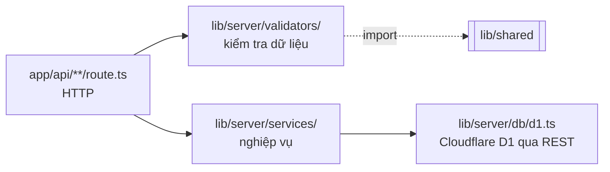

# be-structure.md — cấu trúc phía server (`app/api/` + `lib/server/`)

Mô tả **code hiện có** ở phía server: route handler, validator, service, db — mỗi lớp làm gì và không được làm gì, một request đi qua chúng ra sao.

Đây không phải hợp đồng API. Muốn biết endpoint nào nhận field gì, trả mã lỗi nào → `api-endpoints.md`. Muốn biết bảng D1 hình dạng ra sao → `db-design.md`. File này trả lời câu khác: **code hiện thực những thứ đó ra sao**.

---

## 1. Vai trò

Route handler của App Router, chạy trong **cùng process** với giao diện (`next dev`, cổng 3000). Không có server thứ hai, không có cổng 4000.

> **Trước đây đây là một app Express riêng (`apps/api`, cổng 4000)**, nối với giao diện bằng `rewrites` proxy. Nó bị gỡ vì deploy: quên host nó thì proxy trỏ về `localhost:4000` và **mọi** `/api/*` chết im lặng. Lịch sử đầy đủ ở `ARCHITECTURE.md`. Điều đáng nói cho người đọc code: **validator và service không đổi một dòng nào khi chuyển** — chúng vốn không import gì từ Express. Chỉ tầng HTTP được viết lại.

Ba điều quyết định hình dạng thư mục này:

- **Nơi duy nhất cầm token Cloudflare D1.** Không file nào ngoài `app/api/**` được import từ `lib/server/`, và hàng rào là gói `server-only`: kéo một service vào Client Component là **build đỏ ngay** (CLAUDE.md quy tắc 1).
- **Không biết gì về React.** Không JSX, không component, không render — kể cả khi giờ nó nằm chung project.
- **Mọi route đều `runtime = 'nodejs'`.** `node:crypto` và `AbortSignal.timeout` không chạy được trên Edge runtime. Kèm `dynamic = 'force-dynamic'`: không route nào ở đây được cache tĩnh.

---

## 2. Cây thư mục

```
app/api/                            ← tầng HTTP. Tên THƯ MỤC là URL.
├─ health/route.ts                  GET  /api/health — không chạm D1
├─ events/route.ts                  POST + GET /api/events (đọc: ANALYTICS_TOKEN tuỳ chọn)
├─ analytics/[table]/route.ts       GET  /api/analytics/<table> — 11 bảng dim_*/fact_*, phân trang keyset
├─ auth/{send-code,verify,me,logout}/route.ts
├─ places/route.ts                  GET  /api/places
├─ reverse/route.ts                 GET  /api/reverse
├─ restaurants/route.ts             GET  /api/restaurants — maxDuration = 30
├─ route/route.ts                   GET  /api/route
└─ tiles/route.ts                   GET  /api/tiles — referer lấy từ chính request

lib/server/                         ← không phụ thuộc HTTP. Mọi file `import 'server-only'`.
├─ validators/
│  ├─ event.validator.ts            whitelist 8 field + validate query (session/user/flow/from/to/flat/limit)
│  ├─ analytics.validator.ts        limit (1–5000) + con trỏ `after` + from/to; mã hoá/giải mã cursor
│  ├─ auth.validator.ts · place.validator.ts · route.validator.ts
├─ services/
│  ├─ event.service.ts              createEvent · listEvents (SQL tham số hoá, d1Source cho events-sync)
│  ├─ user.service.ts               recordLogin (upsert users)
│  ├─ analytics.service.ts          ANALYTICS_TABLES (danh sách trắng 11 bảng) · readAnalyticsTable
│  ├─ read-auth.ts                  isReadAllowed — ANALYTICS_TOKEN tuỳ chọn cho các route đọc
│  ├─ events-cache.ts               instance cache của GET /api/events (TTL 5 phút, đối chiếu 24h) + bộ đếm cho /api/health
│  ├─ events-sync.ts                đồng bộ tăng dần theo created_at + đối chiếu COUNT(*) — không import lớp DB
│  ├─ query-cache.ts                cache TTL + single-flight + trả bản cũ khi lỗi
│  ├─ otp.service.ts · auth-token.ts · sms.service.ts
│  ├─ photon.service.ts · overpass.service.ts · route.service.ts · tiles.service.ts
│  └─ upstream.ts                   hàng đợi + cache, DÙNG CHUNG cho các dịch vụ OSM
└─ db/
   └─ d1.ts                         d1Query · d1Batch — REST, retry, timeout; cấu hình đọc trễ

migrations/*.sql · wrangler.jsonc   schema D1 (chỉ dùng cho `wrangler d1 migrations`)
.env.local                          CLOUDFLARE_* · AUTH_SECRET · SMS_* · NOMINATIM_CONTACT (gitignored)
                                    Mẫu ở .env.example
```

`event.validator.ts` là file lớn nhất — xem mục 4 để biết vì sao.

> **`app/api/route/route.ts` không phải lỗi gõ.** Tên thư mục là đường dẫn URL, tên file luôn là `route.ts` — nên endpoint `/api/route` nằm ở đúng chỗ đó.

### Validator nhận thẳng `URLSearchParams` — và đó là lý do việc gộp rẻ

Cả ba validator nhận `URLSearchParams`, không nhận `req` của framework nào. Bản Express phải tự bóc `new URLSearchParams(req.url.split('?')[1] ?? '')`; route handler chỉ cần `request.nextUrl.searchParams`, vốn **đã là** `URLSearchParams`. Nhờ vậy toàn bộ tầng validator và service chuyển sang mà không sửa một dòng.

Giữ nguyên tính chất này khi thêm endpoint mới: **validator và service không được biết mình đang chạy dưới framework nào.**

### `upstream.ts` — vì sao hàng đợi và cache nằm một chỗ

Nominatim và OSRM đều là hạ tầng cộng đồng miễn phí với cùng một ràng buộc: đừng gọi dồn dập, và đừng hỏi lại thứ vừa hỏi. Chép logic đó hai lần nghĩa là sửa một bên quên bên kia — mà triệu chứng của nó là **bị chặn IP giữa lúc demo**, không phải một test đỏ.

`createUpstreamGate({ minGapMs, ttlMs, maxEntries })` trả về `run(key, work)`: đọc cache trước, xếp hàng, chờ đủ khoảng cách, gọi, ghi cache. `photon.service.ts` dùng `minGapMs: 600`, `overpass.service.ts` dùng `300` (Overpass không áp luật 1 req/giây của OSM, và dùng chung gate sẽ kéo cả tra địa chỉ lẫn tuyến đường chậm theo), `route.service.ts` dùng `600`, `tiles.service.ts` dùng `300` với `ttlMs` **6 giờ** (một nhà cung cấp không khoá API key giữa buổi demo).

**Kết quả RỖNG không được cache** (`shouldCache` trong `upstream.ts`). Trước đây `[]` được cache như mọi giá trị khác, nên một lần "không tìm thấy quán nào" đóng băng dải "Gần bạn" suốt cả TTL và nút "Thử lại" trả về đúng mảng rỗng đó tức thì — bấm bao nhiêu lần cũng vô ích.

### `places.*` và `route.*` — vì sao BE phải làm trung gian

`GET /api/places` **không chạm database**, nên nó trả lời được cả khi chưa có credential (giống `/api/health`). Nó tồn tại vì ba việc chỉ server làm được:

1. **`User-Agent` định danh** — điều khoản Nominatim bắt buộc, mà trình duyệt **không cho JavaScript đặt header này**. Đây là lý do chặn cứng.
2. **Hàng đợi ≥ 1100 ms** giữa hai lần gọi upstream — OSM giới hạn tuyệt đối 1 req/giây. Debounce ở client là gợi ý, không phải bảo đảm.
3. **Cache dùng chung** (TTL 10 phút, ~200 khoá) — gõ rồi xoá lùi sẽ hỏi lại đúng những query vừa hỏi.

Lỗi upstream trả **502** chứ không phải 500: lỗi nằm ở dịch vụ bên ngoài, không phải ở app này. FE suy biến êm — `/api/places` lỗi thì vẫn liệt kê 5 địa chỉ gợi ý; `/api/route` lỗi thì dùng `straightRoute()` và ghi `route_source: 'straight'`.

> **`route.service.ts` cố ý KHÔNG tự suy biến về đường thẳng.** Nếu nó lặng lẽ trả về đường chim bay thì `route_source` sẽ ghi `'osrm'` cho một con số không phải đường bộ, và dữ liệu nói dối. Suy biến là việc của FE, nơi biết mình đang dùng đường lui.

---

## 3. Kiến trúc bốn lớp


```mermaid
flowchart LR
  R["app/api/**/route.ts<br/>HTTP"] --> V[lib/server/validators/<br/>kiểm tra dữ liệu]
  R --> S[lib/server/services/<br/>nghiệp vụ]
  S --> D[lib/server/db/d1.ts<br/>Cloudflare D1 qua REST]
  V -.->|import| SH[["lib/shared"]]
```

Ranh giới trách nhiệm — **mỗi lớp không được làm gì** cũng quan trọng như nó làm gì:

| Lớp | Làm | **Không** làm |
|---|---|---|
| `app/api/**/route.ts` | Đọc request, gọi validator, gọi service, chọn mã HTTP | Không tự validate, không tự gọi D1 |
| `validators/` | Kiểm tra kiểu và giá trị, whitelist field | Không chạm D1, không biết framework |
| `services/` | Gắn field server, viết SQL tham số hoá, chuẩn hoá kết quả | Không biết `Request`/`Response`, không trả mã HTTP |
| `db/d1.ts` | Gửi câu lệnh qua REST, retry lỗi tạm, timeout | Không biết bảng nào đang được truy vấn, không bao giờ log token |

Lợi ích cụ thể: `validators/` không phụ thuộc framework nên test được bằng cách gọi hàm thẳng, và `services/` không phụ thuộc HTTP nên script `scripts/*.js` hay worker khác có thể tái dùng ý tưởng (chúng dùng bản sao `scripts/lib/d1-rest.js` vì không import được TypeScript có `server-only`).

---

## 4. Từng lớp

### Khuôn chung của một route handler

Không còn `server.ts` dựng app: App Router tự ghép tên thư mục thành URL. Mỗi file bắt đầu bằng ba khai báo, và cả ba đều bắt buộc:

```ts
export const runtime = 'nodejs';        // node:crypto + AbortSignal.timeout
export const dynamic = 'force-dynamic'; // không được cache tĩnh

export async function GET(request: NextRequest) {
  const result = validateXQuery(request.nextUrl.searchParams);
  if (!result.ok) return Response.json({ error: result.error }, { status: 400 });
  try {
    return Response.json(await doX(result.value));
  } catch (error) {
    console.error('[GET /api/x] …', error);
    return Response.json({ error: 'Câu tiếng Việt' }, { status: 502 });
  }
}
```

Ba thứ mất đi cùng Express, ghi ra đây để không ai đi tìm:

| Bản Express | Bây giờ |
|---|---|
| `cors({ origin: WEB_ORIGIN })` | Không cần — trình duyệt gọi same-origin |
| `express.json({ limit: '64kb' })` | Tự kiểm `content-length` ở đầu `POST /api/events` |
| 404 JSON `{error:'Not found'}` | Trang 404 của Next |

### `app/api/health/route.ts` (15 dòng)
**Không chạm D1, và không import gì từ `lib/server/db`.** Nhờ vậy nó trả lời được ngay cả khi chưa có `.env.local` — xác nhận app chạy đúng trước khi credential vào cuộc. Trả thêm bộ đếm cache (`hits`, `misses`, `refreshes`…) của `GET /api/events`.

### `app/api/events/route.ts` (~95 dòng)
```ts
export async function POST(request: NextRequest)
export async function GET(request: NextRequest)
```
Cùng một khuôn: validate → sai thì 400 → đúng thì gọi service trong `try/catch` → lỗi thì log đầy đủ phía server và trả JSON gọn.

`POST` làm thêm:
- **Giới hạn body** — `content-length > 64 KB` → 413; JSON hỏng → 400.
- **Danh tính:** có cookie `gsm_auth` hợp lệ → `user_id` bị **ghi đè** bằng số điện thoại; không cookie → chỉ nhận `anon-<id>` (`isAnonUserId`), giá trị khác → 401; `confirm_ride`/`place_order` bắt buộc có cookie (`AUTH_REQUIRED_EVENTS`) → 401. Hợp đồng đầy đủ: `api-endpoints.md` mục 1.

`GET` kiểm `isReadAllowed(request, userId)` trước khi đọc: bỏ trống `ANALYTICS_TOKEN` thì mở như trước; có giá trị thì cần `Authorization: Bearer`, riêng người đã đăng nhập vẫn đọc được lịch sử **của chính mình** để `/history` không gãy.

### `app/api/analytics/[table]/route.ts` (40 dòng)
Tra `getAnalyticsTable(name)` trong **danh sách trắng** 11 bảng (`__proto__`, `constructor`… → 404 nhờ `Object.hasOwn`), validate `limit/after/from/to`, rồi `readAnalyticsTable`. Phân trang keyset theo khoá chính (so sánh bộ `(a, b) > (?, ?)`), cắt thân phản hồi dưới 4 MB (giới hạn hàm Vercel), cột boolean 0/1 → `true/false`. Tên bảng và tên cột trong SQL **chỉ** đến từ bảng trắng, không bao giờ từ request.

### `validators/event.validator.ts` (162 dòng) — file lớn nhất BE
```ts
validateEventPayload(body: unknown): ValidationResult
validateEventQuery(params: URLSearchParams): QueryValidationResult
```

Dài vì kiểm **từng field một** và trả đúng câu lỗi mà `api-endpoints.md` quy định, phân biệt "thiếu field" với "sai kiểu":

```
{ "error": "Missing required field: flow" }
{ "error": "Invalid value for flow: expected \"ride\" | \"food\" | \"none\"" }
```

Hai điểm thiết kế:

- **Whitelist, không blacklist.** Chỉ đúng 8 field được lấy ra từ body; mọi field lạ bị bỏ **im lặng** (không trả lỗi). Nhờ vậy client gửi kèm `platform` hay `created_at` cũng không ghi đè được giá trị server tự gắn.
- **Danh sách hợp lệ nhập từ `lib/shared`**, không gõ lại: `isEventName`, `isFlowValue`, `isScreenName`. Đây là lý do danh sách `event_name`/`screen_name` ở FE và BE **không thể lệch nhau** — thêm một event chỉ phải sửa một chỗ.

Trả về kiểu union `{ ok: true, value } | { ok: false, error }` nên TypeScript ép route phải xử lý nhánh lỗi trước khi chạm `value`.

### `validators/analytics.validator.ts` (74 dòng)
`validateAnalyticsQuery(params, { pkLength, hasTimeColumn })`. `after` là `base64url(JSON([pk…]))`, giải mã phải ra đúng độ dài khoá chính và chỉ gồm chuỗi/số hữu hạn, nếu không → 400. `from`/`to` bị từ chối với bảng không có cột thời gian.

### Đăng nhập: `services/otp.service.ts`, `auth-token.ts`, `sms.service.ts`

- `otp.service.ts` — **không dùng database** (D1 hết hạn mức thì vẫn đăng nhập được). `sendCode` sinh mã bằng `crypto.randomInt`, trả thử thách đã ký HMAC `{phone, hash(mã), hết hạn, nonce}` để route đặt vào cookie httpOnly `gsm_otp` (path `/api/auth`). `verifyCode` kiểm cookie đó. Cooldown 60s và đếm 5 lần sai nằm trong bộ nhớ tiến trình (best effort).
- `user.service.ts` — `recordLogin` upsert bảng `users` (một câu `INSERT … ON CONFLICT DO UPDATE`) **best effort**: D1 lỗi thì chỉ log, không chặn đăng nhập.
- `auth-token.ts` — ký / kiểm cookie `gsm_auth` bằng HMAC-SHA256 (`AUTH_SECRET`). `readAuth(request)` là thứ `POST /api/events` gọi để lấy `user_id`.
- `sms.service.ts` — interface `SmsSender`. Đổi mock → SMS thật = thêm một sender dùng `fetch` + đổi `SMS_PROVIDER`; không route nào phải sửa.

### `services/event.service.ts` (~250 dòng)
```ts
createEvent(payload: EventPayload): Promise<CreateEventResponse>
listEvents(query: EventQuery): Promise<{ events; cacheStatus }>
```
- **`createEvent`** sinh `id` 20 ký tự bằng `crypto.randomInt`, `created_at` = `toIsoMicros(new Date())` (UTC, micro-giây cố định độ rộng), gắn `platform = 'web'`, rồi một câu `INSERT` (4 lượt ghi: 1 dòng + 3 index). Chỉ **sau khi** INSERT thành công mới `invalidateEventsFor(session, user)`.
- **`listEvents`** đọc qua cache (`events-cache.ts`). `whereClause(query)` dựng điều kiện `session_id/user_id/flow/created_at` tham số hoá; `fetchEvents` sắp `step_index, created_at, id` (lọc session) hoặc `created_at, id` (còn lại), `LIMIT` đẩy xuống DB; `?flat=1` trải `properties` thành cột `prop_*` bằng `flatten()` **sau** cache nên chung một lần đọc D1.
- **`d1Source(query)`** nối `events-sync.ts` với D1: `fetchSince` đọc `created_at >= cursor − 5 giây` (cửa sổ gối đầu vì `created_at` do app gán, không phải giờ commit), `countUpTo` là `COUNT(*)`.

`created_at` trả về là giá trị **thật** app đã ghi (không phải xấp xỉ như thời `serverTimestamp()`), nhưng `Response` của `POST` vẫn chỉ gồm `event_id` + `created_at`.

### `db/d1.ts` (~125 dòng)
```ts
d1Query<T>(sql: string, params?: unknown[]): Promise<{ results: T[]; meta }>
d1Batch(statements: { sql; params? }[]): Promise<D1Result[]>   // một transaction
class D1Error
```
- Gửi `POST /accounts/{id}/d1/database/{db}/query` với `Authorization: Bearer`. Một câu → `{ sql, params }`; nhiều câu → `{ batch: [...] }` (tất cả hoặc không).
- **Timeout 15 giây** (`AbortSignal.timeout`), **tối đa 3 lần** cho lỗi tạm (429, 5xx, mạng) với backoff 300 ms → 900 ms; lỗi SQL/quyền ném thẳng — thử lại không sửa được.
- Thiếu `CLOUDFLARE_*` → `D1Error` chỉ rõ thiếu biến nào. Thông báo không bao giờ chứa token.
- **Mọi SQL tham số hoá.** Giới hạn D1: ≤ 100 tham số/câu, ≤ 100 KB/câu.

---

## 5. Luồng `POST /api/events`

```
1. đọc cookie gsm_auth                         (readAuth — không chạm DB)
2. content-length > 64 KB ?                    → 413
3. request.json()                              → hỏng: 400
4. xác định user_id: cookie → ghi đè SĐT; không cookie → phải là anon-…, nếu không 401;
   confirm_ride / place_order không cookie → 401
5. validateEventPayload(body)                  → sai: 400 + câu lỗi cụ thể
6. createEvent(value)                          → INSERT vào D1 (REST) → 201 { event_id, created_at }
7. lỗi D1                                      → log đầy đủ phía server, 500 { error: "Could not write event" }
```

Bước 4–5 là hàng rào: không gì chạm tới D1 trước khi qua được nó. Bước 6 là nơi duy nhất `platform` và `created_at` được gắn.

## 6. Luồng `GET /api/events`

1. `validateEventQuery` → 400 nếu tham số sai. 2. `isReadAllowed` → 401 nếu cần token mà thiếu. 3. `listEvents`: cache hit → trả ngay (`X-Cache: HIT`); miss/hết hạn → `syncEvents` (đọc tăng dần `created_at >= cursor − 5s`, gộp theo id, đối chiếu `COUNT(*)`; lệch → đọc lại toàn bộ). 4. Trả mảng event, `created_at` là chuỗi ISO µs.

Quy tắc sắp xếp: có `session_id` → theo `step_index`; còn lại → `created_at, id`. **Lọc `user_id` giờ sắp và `LIMIT` thẳng ở DB** (có `idx_events_user_created_at`) — ràng buộc "sắp trong bộ nhớ để tránh composite index" của Firestore đã hết.

## 7. Xử lý lỗi — ba loại, ba cách

| Lỗi | HTTP | Ở đâu | Cách xử lý |
|---|---|---|---|
| Body/query sai | **400** | validator | trả câu lỗi cụ thể (`api-endpoints.md`) |
| Chưa đăng nhập / thiếu token | **401** | route | `{ error }` ngắn |
| Ghi D1 hỏng | **500** | `createEvent` | log đầy đủ phía server, trả `{ error: "Could not write event" }` gọn |
| Đọc D1 hỏng | **500** | `listEvents`, `readAnalyticsTable` | log đầy đủ, trả `{ error: "Could not read events" }` / `"Could not read table"` (**không** còn trả nguyên văn lỗi DB như thời Firestore — lúc đó nó chứa link tạo index, giờ không có chuyện đó) |
| Dịch vụ OSM ngoài hỏng | **502** | `places`, `restaurants`, `route` | lỗi nằm ở dịch vụ ngoài, FE suy biến êm |

Đăng nhập **không** phụ thuộc D1 (`recordLogin` best effort), nên D1 hết hạn mức vẫn đăng nhập được; client (`lib/track.ts`) nuốt lỗi gửi event nên UI không bao giờ kẹt.

## 8. Vì sao cấu hình D1 đọc trễ

`readConfig()` trong `d1.ts` chỉ chạy ở lần gọi D1 đầu tiên, không phải lúc module load. Nhờ vậy `GET /api/health`, các route OSM và đăng nhập (trừ bước ghi sổ) **chạy được khi chưa có `.env.local`** — trạng thái "chưa có D1" vẫn dùng được: app chạy, click hết cả hai luồng, chỉ là event không lưu (`POST /api/events` → 500 kèm log chỉ rõ thiếu biến nào).

## 9. Thêm một endpoint mới

1. **`api-endpoints.md` trước** — chốt path, method, request/response, mã lỗi. Tài liệu là hợp đồng; code đi sau.
2. **`validators/`** — thêm hàm validate, trả kiểu union `{ ok, ... }`. Danh sách giá trị hợp lệ nhập từ `lib/shared`, đừng gõ lại.
3. **`services/`** — thêm hàm nghiệp vụ. Không nhận `req`/`res`, chỉ nhận dữ liệu đã sạch.
4. **`routes/`** — nối hai thứ trên, chọn mã HTTP, bọc `try/catch`.
5. **Tạo thư mục** `app/api/<tên>/route.ts` — không có bước đăng ký nào, tên thư mục chính là URL.

Thêm field vào event thì sửa `EventPayload` trong `lib/shared/types.ts` **và** whitelist trong `event.validator.ts` — whitelist hiện chỉ lấy đúng 8 field, field mới không thêm vào đó sẽ bị loại im lặng.

---

## 10. Nhập gì từ `lib/shared`

BE dùng shared rất ít, đúng một mục đích: **hợp đồng dữ liệu**.

| Nhập | Dùng ở | Để làm gì |
|---|---|---|
| `isEventName`, `isFlowValue` | `event.validator.ts` | Kiểm tra `event_name`, `flow` |
| `isScreenName` (từ `screens.ts`) | `event.validator.ts` | Kiểm tra `screen_name`, `previous_screen` |
| `EventPayload` | validator, service | Kiểu của 8 field sau khi validate |
| `CreateEventResponse` | `event.service.ts` | Kiểu response 201 |

BE **không** dùng `mock-data.ts` hay `pricing.ts` — dữ liệu tĩnh và tính tiền là việc của FE. Server chỉ nhận con số FE đã tính và ghi xuống, không tính lại.

> Đây là điểm cần biết khi đọc dữ liệu phân tích: `final_price` trong event là giá trị FE tính rồi gửi lên, server không kiểm chứng. Trong phạm vi mô phỏng (không có tiền thật, không có người dùng đối nghịch) đây là đánh đổi có chủ ý. Cả hai phía dùng chung `calcRideTotals` / `calcFoodTotals` nên con số vẫn nhất quán với những gì hiển thị trên màn hình.

---

## 11. Trạng thái: BE đã xong tới đâu

**BE chạy thật với Cloudflare D1** (`gsm-db`). Đã kiểm chứng ở `docs/migration-verification.md`:

| Hạng mục | Kết quả |
|---|---|
| `POST/GET /api/events` | hợp đồng giữ nguyên so với bản Firestore; `created_at` µs |
| Đồng bộ tăng dần | log `INCREMENTAL SYNC fetched=3 new=1 cached=9161` — không đọc lại cả bảng |
| `GET /api/analytics/<table>` | 11 bảng, phân trang keyset, `ANALYTICS_TOKEN` tuỳ chọn |
| Database | `node scripts/test-d1.js` 29/29 (CRUD, ràng buộc, khoá ngoại, batch nguyên tử, plan dùng index) |
| Trình duyệt thật | luồng Đặt xe 22/22, Food 16/16 (`scripts/e2e/`) |
| Lỗi D1 | API 500 gọn, không lộ token, đăng nhập vẫn chạy, UI không vỡ |

## 12. Bộ lệnh test từng endpoint

Phần không cần D1 trước, phần cần D1 sau. Nhờ **cấu hình đọc trễ** (mục 8), nhóm A chạy được ngay khi vừa `npm install`.

### Nhóm A — không cần D1
```bash
curl -s localhost:3000/api/health                        # {"status":"ok","events_cache":{…}}
# validator chặn trước khi chạm DB (HTTP 400):
curl -s -X POST localhost:3000/api/events -H 'Content-Type: application/json' -d '{"user_id":"anon-0123456789ab"}'
curl -s -X POST localhost:3000/api/events -H 'Content-Type: application/json' \
  -d '{"user_id":"anon-0123456789ab","session_id":"s","flow":"zzz","event_name":"screen_view","screen_name":"home","step_index":0}'
```
Gõ nhầm `event_name` (`select_vehicel`), `screen_name` lạ, `step_index` âm, `session_id` rỗng… đều 400 kèm câu lỗi cụ thể — nhờ `lib/shared` chung nên danh sách hợp lệ ở FE và BE không thể lệch nhau.

### Nhóm B — cần D1 (sau `setup.md` Phase 1)
```bash
node scripts/smoke-production.js http://localhost:3000 --login   # 15 kiểm tra end-to-end (tự dọn dữ liệu thử)
node scripts/test-d1.js                                          # 29 kiểm tra database
curl -s "localhost:3000/api/events?flow=food&limit=3" | jq '.[].event_name'
curl -s "localhost:3000/api/analytics/dim_user?limit=2" | jq '{n: (.rows|length), next: .next_cursor}'
```
Event mới thêm field optional lạ vào body (`device_type`) → **bị whitelist loại im lặng**, request vẫn 201; kiểm bằng `SELECT * FROM events ORDER BY created_at DESC LIMIT 1` (qua `npx wrangler d1 execute gsm-db --remote --command …`) thấy cột/`properties` không có field đó.
