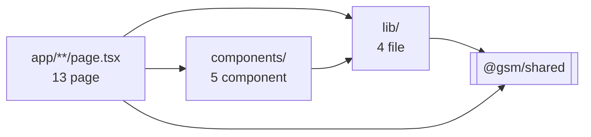

# fe-structure.md — cấu trúc frontend (`apps/web`)

Mô tả **code hiện có** trong `apps/web`: file nào làm gì, phụ thuộc vào đâu, một tương tác đi qua những lớp nào.

Đây không phải hợp đồng dữ liệu. Muốn biết event nào mang field gì → `event-taxonomy.md`. Muốn biết route và quy tắc state → `screen-map.md`. File này trả lời câu khác: **code hiện thực những thứ đó ra sao**.

---

## 1. Vai trò

Next.js 15 (App Router), cổng **3000**. Chỉ frontend — **không có một dòng server-side logic nào**.

Ba điều quyết định hình dạng của toàn bộ thư mục này:

- **Mọi page đều `'use client'`.** Vì page nào cũng cần đọc state (giỏ hàng, lựa chọn) và bắn event, không có page nào render được ở server.
- **Không có `firebase-admin` trong `dependencies`.** Credential nằm ở `apps/api`, một module graph khác — FE muốn chạm Firestore cũng không import nổi. Xem `CLAUDE.md` quy tắc 1.
- **Không có `app/api/`.** API là process riêng ở cổng 4000; `next.config.ts` proxy `/api/*` sang đó.

---

## 2. Cây thư mục

```
apps/web/
├─ next.config.ts          transpilePackages + rewrites proxy → :4000
├─ postcss.config.mjs      plugin @tailwindcss/postcss
├─ eslint.config.mjs
├─ tsconfig.json           paths: @/* và @gsm/shared
│
├─ app/
│  ├─ layout.tsx           font Inter (subset vietnamese) + <AppProvider>
│  ├─ globals.css          @theme token + 13 class .t-* + .shadow-level-2
│  ├─ page.tsx             Home
│  ├─ ride/
│  │  ├─ address/page.tsx     tìm + chọn điểm đến
│  │  ├─ pickup/page.tsx      xác nhận điểm đón (hằng số) + ghi chú tài xế
│  │  ├─ vehicle/page.tsx     bản đồ tuyến + chọn 1 trong 6 hạng xe
│  │  ├─ promo/page.tsx       tab + ô nhập mã + chọn/bỏ qua khuyến mãi
│  │  ├─ confirm/page.tsx     tóm tắt + phương thức thanh toán + nút đặt cuối
│  │  └─ success/page.tsx     màn kết thúc luồng ride
│  └─ food/
│     ├─ page.tsx             menu 8 món + chip lọc
│     ├─ item/[itemId]/page.tsx  chi tiết món + chọn số lượng
│     ├─ cart/page.tsx        giỏ hàng: sửa số lượng, xoá dòng
│     ├─ offer/page.tsx       chọn hoặc bỏ qua ưu đãi
│     ├─ confirm/page.tsx     tóm tắt đơn + nút đặt cuối
│     └─ success/page.tsx     màn kết thúc luồng food
│
├─ lib/
│  ├─ track.ts             trackEvent · trackAddToCart · useScreenView
│  ├─ app-context.tsx      AppProvider · useApp — state ride + cart
│  ├─ session.ts           session_id / user_id / resetSession
│  └─ format.ts            formatVnd — số nguyên VNĐ → "35.000đ"
│
└─ components/
   ├─ ScreenShell.tsx      nav-bar + container 480px + footer sticky
   ├─ PrimaryButton.tsx    3 biến thể: primary / secondary / subtle
   ├─ BackButton.tsx       bắn event `back` rồi điều hướng
   ├─ FlowGuard.tsx        chặn vào thẳng URL giữa luồng
   └─ MapCanvas.tsx        bản đồ giả lập bằng SVG (không thư viện)
```

---

## 3. Sơ đồ phụ thuộc

Phụ thuộc đi **một chiều**, không có vòng:



Điều này có nghĩa: sửa `lib/` ảnh hưởng tới mọi page; sửa một page không ảnh hưởng tới gì khác. Khi cần đổi cách bắn event, sửa **một chỗ** trong `lib/track.ts`.

---

## 4. Bảng 13 page

| Route | `screen_name` | step | Guard | Event bắn ra (ngoài `screen_view`) | Dòng |
|---|---|:--:|:--:|---|--:|
| `/` | `home` | 0 | — | `select_flow` | 72 |
| `/ride/address` | `address_selection` | 1 | — | `select_address` | 147 |
| `/ride/pickup` | `pickup_confirm` | 2 | ✓ | `confirm_pickup`, `change_address` | 115 |
| `/ride/vehicle` | `vehicle_selection` | 3 | ✓ | `select_vehicle` | 131 |
| `/ride/promo` | `promo_selection` | 4 | ✓ | `select_promo`, `skip_promo` | 190 |
| `/ride/confirm` | `ride_confirm` | 5 | ✓ | `confirm_ride` | 135 |
| `/ride/success` | `ride_success` | 6 | — | `back_to_home` | 89 |
| `/food` | `food_menu` | 1 | — | `select_item`, `add_to_cart` | 147 |
| `/food/item/[itemId]` | `food_item_detail` | 2 | ✓ | `change_quantity`, `add_to_cart` | 129 |
| `/food/cart` | `food_cart` | 4 | ✓ | `change_quantity`, `remove_from_cart`, `proceed_to_offer` | 164 |
| `/food/offer` | `food_offer_selection` | 5 | ✓ | `select_offer`, `skip_offer` | 92 |
| `/food/confirm` | `food_confirm` | 6 | ✓ | `place_order` | 100 |
| `/food/success` | `food_success` | 7 | — | `back_to_home` | 72 |

> **Không page nào gõ `step_index`.** Cột `step` ở trên do `trackEvent` tra bảng `SCREENS` trong `@gsm/shared`. Để đây chỉ để đối chiếu nhanh với `event-taxonomy.md`.

> **Event `back` không có trong bảng** vì nó không nằm trong file page nào cả — xem mục 6.

> **Hai màn không bắn event khi bấm nút chính.** Ở `/ride/vehicle`, `select_vehicle` bắn khi bấm *hạng xe*, còn nút "Tiếp tục" chỉ điều hướng. Ở `/ride/promo`, bấm promo chỉ tick chọn, `select_promo` bắn khi bấm "Áp dụng mã". Hệ quả: một session có thể có **nhiều** `select_vehicle` (đo được sự phân vân) nhưng đúng **một** `select_promo`. Chi tiết ở `ride-flow-design.md` mục 7.

---

## 5. `lib/` — bốn file

### `track.ts` (110 dòng) — quan trọng nhất
```ts
trackEvent(input): void          // KHÔNG async, không ai await được
trackAddToCart(screenName, properties): void
useScreenView(screenName): void
resetPreviousScreen(): void
```

Ba thứ file này giữ mà không chỗ nào khác giữ:

1. **`previousScreen`** — biến module-level, cập nhật sau mỗi `screen_view`. Không suy ra từ route vì Back của trình duyệt sẽ làm mọi suy luận từ route sai.
2. **Tra bảng `SCREENS`** để điền `flow` và `step_index`. Hai tham số đó *có thể* truyền tay nhưng chỉ dùng cho đúng hai ngoại lệ: `add_to_cart` (luôn step 3) và `select_flow` ở Home (flow là giá trị vừa chọn).
3. **`useRef` chặn React Strict Mode** trong `useScreenView`. Thiếu nó thì mọi `screen_view` nhân đôi và funnel sai gấp đôi.

`trackEvent` trả `void` có chủ ý — không ai `await` được nên không thể vô tình chặn điều hướng. Kèm `keepalive: true` và `.catch(() => {})`.

### `app-context.tsx` (209 dòng)
```ts
AppProvider({ children })    // đặt một lần trong app/layout.tsx
useApp(): AppContextValue
```

Giữ `ride`, `cart`, `offerId`, `sessionId`, `userId`, và cờ **`hydrated`**.

`RideDraft` có 5 trường: `addressId` (**điểm đến** — điểm đón là hằng số `FIXED_PICKUP`), `vehicleId`, `promoId`, `driverNote`, `paymentMethod`.

`hydrated` tồn tại vì một lý do cụ thể: trước khi `useEffect` đọc xong `sessionStorage` thì state luôn rỗng. Không có cờ này, `FlowGuard` sẽ đá người dùng ra khỏi luồng **mỗi lần F5**.

Đồng bộ ngược xuống `sessionStorage` qua ba `useEffect` (`gsm_ride_draft`, `gsm_cart`, `gsm_offer`), đều bọc try/catch — storage đầy hoặc bị chặn không được làm vỡ UI.

### `session.ts` (58 dòng)
```ts
getSessionId() · getUserId() · resetSession() · DRAFT_KEYS
```

`session_id` ở `sessionStorage` (một tab = một lượt thử luồng), `user_id` ở `localStorage` (bền qua nhiều ngày). `resetSession()` sinh id mới và xoá sạch draft — gọi khi bấm "Về trang chủ".

Mọi hàm ở đây chỉ được gọi trong `useEffect` hoặc event handler. Gọi lúc render sẽ lỗi hydration vì `crypto.randomUUID()` và `sessionStorage` không tồn tại phía server.

### `format.ts` (17 dòng)
```ts
formatVnd(35000) → "35.000đ"
```
Tiền **luôn** là số nguyên trong dữ liệu, chỉ format khi hiển thị.

---

## 6. `components/` — năm component

| Component | Props | Dùng ở | Ghi chú |
|---|---|:--:|---|
| `ScreenShell` | `title`, `leading`, `trailing`, `children`, `footer` | 12 page | Container 480px, nav-bar sticky, footer có `shadow-level-2` + `env(safe-area-inset-bottom)`. `trailing` là khối phải nav-bar (selector "Hà Nội", nút "Đặt hộ") |
| `PrimaryButton` | `variant`, `fullWidth`, + props button | 11 page | Nền `primary-dark` chứ không `primary` — tương phản 4.2:1 thay vì 2.6:1 (`tailwind-theme.md` mục 0b) |
| `BackButton` | `from`, `to`, `href`, `glyph` | 10 page | **Bắn event `back`** rồi mới `router.push`. `glyph` mặc định `←`; `/ride/promo` truyền `×` cho giống overlay — hình khác nhưng event y hệt |
| `FlowGuard` | `ready`, `fallback`, `children` | 8 page | Đợi `hydrated` trước khi redirect |
| `MapCanvas` | `variant: 'pickup' \| 'route'` | 3 page | SVG inline, **không thư viện bản đồ** (`CLAUDE.md` quy tắc 8). Dùng ở `/ride/pickup`, `/ride/vehicle`, `/ride/confirm` |

### `MapCanvas` — vì sao toạ độ là hằng số

Đường phố, tuyến đường và vị trí ghim đều hardcode trong file. Không random: bản đồ đổi hình mỗi lần re-render trông như lỗi chứ không như bản đồ. `variant="route"` vẽ polyline gãy khúc theo lưới phố và phủ tooltip `34 phút • 15 km` lấy từ `FIXED_ROUTE`.

### `BackButton` — chỗ dễ nhầm khi đọc code

Grep `eventName: 'back'` trong `app/` sẽ ra **rỗng**. Event `back` được bắn bên trong `BackButton.tsx`, không phải trong page.

Mười cặp `from → to` (đã đối chiếu khớp với `properties.to_screen` ở `event-taxonomy.md`):

| `from` | `to` | `href` |
|---|---|---|
| `address_selection` | `home` | `/` |
| `pickup_confirm` | `address_selection` | `/ride/address` |
| `vehicle_selection` | `pickup_confirm` | `/ride/pickup` |
| `promo_selection` | `vehicle_selection` | `/ride/vehicle` |
| `ride_confirm` | `promo_selection` | `/ride/promo` |
| `food_menu` | `home` | `/` |
| `food_item_detail` | `food_menu` | `/food` |
| `food_cart` | `food_menu` | `/food` |
| `food_offer_selection` | `food_cart` | `/food/cart` |
| `food_confirm` | `food_offer_selection` | `/food/offer` |

Hai màn success không có `BackButton` — chúng dùng `router.replace` để Back không quay ngược vào session đã đóng.

### `FlowGuard` — điều kiện từng page

| Page | `ready` | `fallback` |
|---|---|---|
| `/ride/pickup` | `Boolean(ride.addressId)` | `/ride/address` |
| `/ride/vehicle` | `Boolean(ride.addressId)` | `/ride/address` |
| `/ride/promo` | `addressId && vehicleId` | `/ride/address` |
| `/ride/confirm` | `addressId && vehicleId && promoId !== undefined` | `/ride/address` |
| `/food/item/[itemId]` | `Boolean(item)` — id có thật | `/food` |
| `/food/cart` | `cart.length > 0` | `/food` |
| `/food/offer` | `cart.length > 0` | `/food` |
| `/food/confirm` | `cart.length > 0 && offerId !== undefined` | `/food` |

Năm page **không** có guard: `home`, `/ride/address`, `/food` (đầu luồng, không có gì để bảo vệ) và hai màn success (vào được là do vừa hoàn thành luồng).

Guard chạy **trước** khi nội dung mount, nên `useScreenView` bên trong không kịp chạy — bị chặn thì không sinh event nào. Đó là chủ ý: tránh session rác trong dữ liệu phân tích.

---

## 7. Luồng một tương tác

Người dùng bấm "Green Bike" ở `/ride/vehicle`:

```
1. onClick trong ride/vehicle/page.tsx
2. trackEvent({ eventName: 'select_vehicle', screenName: 'vehicle_selection', properties })
3. lib/track.ts   tra SCREENS['vehicle_selection'] → flow 'ride', step_index 3
                  chèn session_id, user_id (lib/session.ts), previous_screen (biến module)
4. fetch('/api/events', { keepalive: true }).catch(() => {})   ← KHÔNG await
5. setRide({ vehicleId })        → app-context ghi kèm sessionStorage
6. (ở lại màn — dòng vừa chọn hiện ring-2 ring-primary)
```

Điều hướng xảy ra ở một lần bấm khác, khi người dùng bấm "Tiếp tục" — lúc đó **không bắn event**. Đổi ý và bấm sang hạng xe khác thì bước 1–5 chạy lại, sinh thêm một `select_vehicle` nữa.

Chỗ đáng chú ý là bước 4 **không được `await`**. Ở những màn mà event bắn ngay trước `router.push` (`confirm_ride` ở `/ride/confirm`, `place_order` ở `/food/confirm`), `await` sẽ làm UI khựng ~200ms mỗi lần bấm — lỗi dễ mắc nhất trong loại app này. `trackEvent` trả `void` nên không ai `await` được, và `keepalive: true` lo phần gửi nốt khi trang đã chuyển.

Request rời trình duyệt là **same-origin** (`/api/events`), Next.js proxy sang `:4000`. Ghi thẳng `http://localhost:4000` sẽ thành cross-origin, kích hoạt preflight `OPTIONS`, và `confirm_ride` / `place_order` — hai event bắn ngay trước khi chuyển trang — không kịp gửi. Lý do đầy đủ ở `techstack.md`.

Phần còn lại của hành trình (từ `:4000` trở đi) → `be-structure.md`.

---

## 8. Nhập gì từ `@gsm/shared`

FE dùng shared cho hai việc, không hơn:

**Dữ liệu tĩnh để render** — `ADDRESSES`, `VEHICLES`, `PROMOS`, `OFFERS`, `FOOD_ITEMS`, `SHIPPING_FEE`, `FIXED_PICKUP`, `FIXED_ROUTE`, và các hàm `getAddress` / `getVehicle` / `getPromo` / `getOffer` / `getFoodItem`.

**Tính tiền** — `calcDiscount`, `isRuleAvailable`, `calcRideTotals`, `calcFoodTotals`. Màn confirm hiển thị số tiền và event `confirm_ride` / `place_order` ghi số tiền, **cùng một hàm** — nên hai chỗ không thể lệch nhau.

| Page | Import |
|---|---|
| `/ride/address` | `ADDRESSES`, `type Address` |
| `/ride/pickup` | `FIXED_PICKUP`, `getAddress` |
| `/ride/vehicle` | `VEHICLES`, `type Vehicle` |
| `/ride/promo` | `PROMOS`, `calcDiscount`, `getVehicle`, `isRuleAvailable` |
| `/ride/confirm` | `FIXED_PICKUP`, `calcRideTotals`, `getAddress`, `getPromo`, `getVehicle` |
| `/ride/success` | `calcRideTotals`, `getAddress`, `getPromo`, `getVehicle` |
| `/food` | `FOOD_CATEGORIES`, `FOOD_ITEMS`, `calcFoodTotals`, `getFoodItem` |
| `/food/item/[itemId]` | `calcFoodTotals`, `getFoodItem` |
| `/food/cart` | `SHIPPING_FEE`, `calcFoodTotals`, `getFoodItem` |
| `/food/offer` | `OFFERS`, `calcDiscount`, `calcFoodTotals`, `getFoodItem`, `isRuleAvailable` |
| `/food/confirm` · `/food/success` | `calcFoodTotals`, `getFoodItem`, `getOffer` |

Ngoài page: `lib/track.ts` nhập `SCREENS` và `ADD_TO_CART_STEP_INDEX`; `components/MapCanvas.tsx` nhập `FIXED_ROUTE`. Nội dung thật của các hằng số này ở `mock-data.md` và `event-taxonomy.md`.

`FIXED_PICKUP` và `FIXED_ROUTE` chỉ để hiển thị — **không** đi vào event, vì hằng số thì mọi document đều giống nhau (`ride-flow-design.md` mục 5.2).

---

## 9. Thêm một màn mới — thứ tự bắt buộc

Làm sai thứ tự sẽ sinh dữ liệu không dùng được:

1. **`event-taxonomy.md`** — thêm màn vào bảng mục 2, thêm event vào mục 3/4. Chốt với mentor **trước khi code** (`CLAUDE.md` quy tắc 6).
2. **`packages/shared/src/screens.ts`** — thêm vào `SCREENS` kèm `route`, `stepIndex`, `flow`. Thêm `ScreenName` mới vào `types.ts`.
3. **`apps/web/app/.../page.tsx`** — `'use client'`, gọi `useScreenView('<screen_name>')`, bọc `<ScreenShell>`.
4. **Guard nếu cần** — màn giữa luồng thì bọc `<FlowGuard>` với điều kiện state tương ứng.
5. **Kiểm tra** — đi hết luồng rồi đếm: số `screen_view` phải đúng bằng số màn đã qua.

Thêm `EventName` mới thì phải sửa **cả** union lẫn mảng `EVENT_NAMES` trong `types.ts` — có type assertion bắt lỗi nếu quên, nhưng biết trước vẫn hơn.

---

## 10. Giới hạn đã biết

**Guard chặn state rỗng, không ép thứ tự bước.**

Guard của `/ride/vehicle` chỉ kiểm tra `ride.addressId`. Gõ thẳng URL `/ride/vehicle` sau khi đã chọn địa chỉ sẽ **bỏ qua được `/ride/pickup`**, làm session thiếu step 2 trong funnel.

Đây là hệ quả chấp nhận được của thiết kế ở `screen-map.md` mục 1 — guard sinh ra để tránh session rỗng, không phải để chống người dùng cố tình. Trong phạm vi dự án (tự click sinh dữ liệu) không ai làm vậy.

**Giờ đã có cách sửa rẻ hơn trước.** `confirm_pickup` bây giờ gọi `setRide({ driverNote })` — kể cả khi ô ghi chú để trống, vì `driverNote` được ghi là chuỗi rỗng chứ không phải `undefined`. Nghĩa là `ride.driverNote !== undefined` đã là một tín hiệu đáng tin cho "đã đi qua bước 2", không cần thêm trường `pickupConfirmed` như ghi chú cũ đề xuất. Vẫn chưa đưa vào điều kiện `ready` vì tình huống này không xảy ra trong thực tế dùng — nhưng nếu funnel có số lạ ở step 2 thì đây là chỗ sửa, một dòng.

**Hai màn success đọc state rồi mới xoá.** Cả hai chụp tóm tắt vào `useState` trong `useEffect` trước khi gọi `clearRide()` / `clearCart()`. Bỏ bước chụp đó thì màn hình trống rỗng ngay sau khi render lần đầu.
